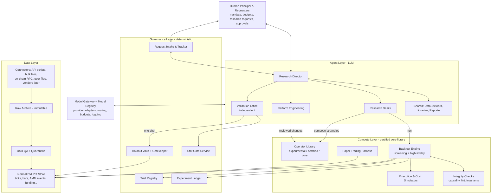
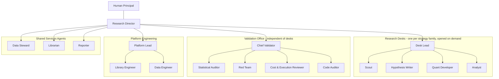
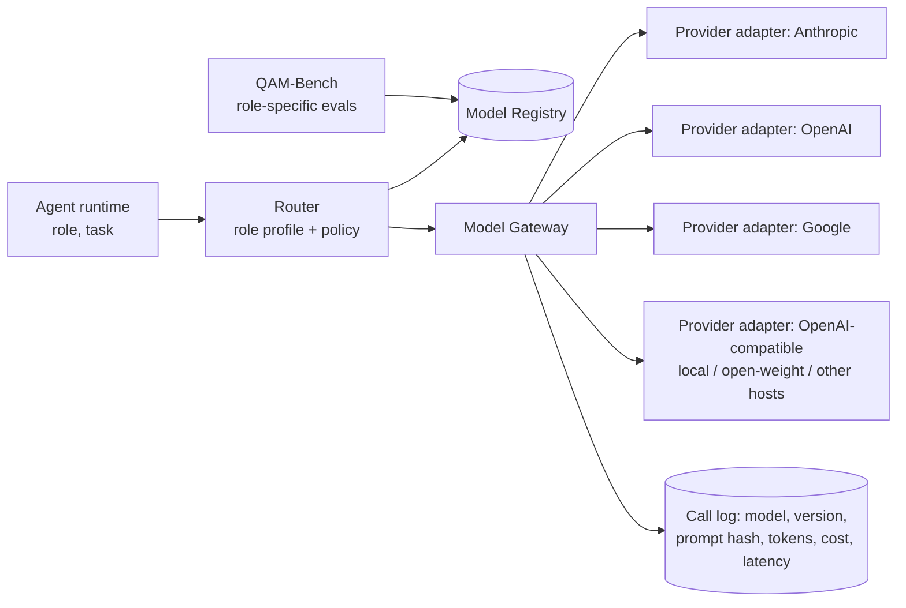
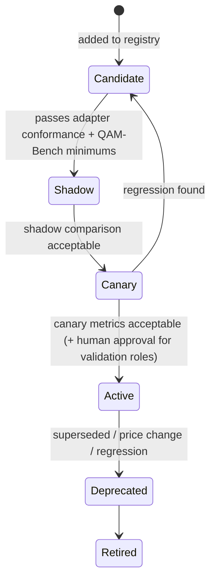
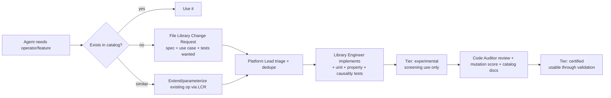

# QAM — Agentic Quantitative Research System: Design Document

| | |
|---|---|
| **Status** | Draft (living document) |
| **Version** | 0.4.0 |
| **Last updated** | 2026-10-05 |
| **Owner** | @brandongla |
| **Initial scope** | Cryptocurrencies, focused on decentralized exchanges (DEXs) |
| **Future scope** | Equities, ETFs, options, futures, other asset classes |

> **How to use this document.** This is the single source of truth for QAM's specifications.
> Any change to scope, architecture, gates, thresholds, models, data sources, or agent roles must
> be reflected here in the same change set, with an entry in the [Decision Log](#19-decision-log)
> (for decisions) and the [Changelog](#21-changelog) (for every revision). Sections marked
> **[OPEN]** are not yet decided; sections marked **[DEFAULT]** contain starting values we expect
> to tune.

---

## Table of Contents

1. [Purpose & Goals](#1-purpose--goals)
2. [Non-Goals (v1)](#2-non-goals-v1)
3. [Guiding Principles](#3-guiding-principles)
4. [System Overview](#4-system-overview)
5. [Agent Hierarchy](#5-agent-hierarchy)
6. [Model Selection & Provider Abstraction](#6-model-selection--provider-abstraction)
7. [Human Research Requests & Reporting](#7-human-research-requests--reporting)
8. [Research Lifecycle (State Machine)](#8-research-lifecycle-state-machine)
9. [False-Positive Control Framework](#9-false-positive-control-framework)
10. [Core Research Library & Engine Integrity](#10-core-research-library--engine-integrity)
11. [Data Platform](#11-data-platform)
12. [Execution Realism (DEX-first)](#12-execution-realism-dex-first)
13. [Pilot Universe & Research Agenda](#13-pilot-universe--research-agenda)
14. [Efficiency & Budgeting](#14-efficiency--budgeting)
15. [Provenance, Reproducibility & Memory](#15-provenance-reproducibility--memory)
16. [Extensibility to Other Asset Classes](#16-extensibility-to-other-asset-classes)
17. [Technology Stack](#17-technology-stack)
18. [Roadmap](#18-roadmap)
19. [Decision Log](#19-decision-log)
20. [Open Questions](#20-open-questions)
21. [Changelog](#21-changelog)
22. [Glossary](#22-glossary)

---

## 1. Purpose & Goals

QAM is a system in which **hierarchical teams of AI agents** generate, implement, test, and
critique quantitative trading hypotheses. A single, rigorously tested core library does all the
computation, and statistical controls sit in the path of every result.

### Primary goals

| # | Goal | How we measure it |
|---|------|-------------------|
| G1 | **Minimize false positives.** Strategies that reach "Validated" should have real, persistent edge net of all costs. | Empirical pipeline false-discovery rate (FDR) from null-strategy injection (§9.6); decay from holdout to paper trading. |
| G2 | **Keep statistical power.** Don't reject real edges so aggressively that nothing gets through. | True-positive rate on synthetic planted-edge strategies (§9.6). |
| G3 | **Efficiency.** Get the most validated insight per dollar of compute and LLM spend. | Cost per hypothesis evaluated; cost per validated strategy; time from idea to decision. |
| G4 | **Reproducibility.** Any reported number can be regenerated exactly. | 100% of results linked to an immutable experiment record (§15). |
| G5 | **Extensibility.** New asset classes, data sources, and LLM models plug in without redesigning the core. | New adapter, connector, or model needs no changes to the lifecycle or statistics code (§6, §11, §16). |
| G6 | **Engine correctness.** The shared engine has no bugs that inflate results. | Certification suite passes (§10.5). Seeded-defect detection rate is 100% on the canary suite. |
| G7 | **Human usability.** People can submit ideas and get clear, honest answers. | Request turnaround time. Every request closes with a structured report (§7). |

### Success criteria for v1
- An end-to-end pipeline that takes a crypto hypothesis from idea to a paper-trading decision with full provenance.
- A certified core engine and operator library (§10).
- A measured pipeline FDR at or below the target (§9.1) on injected null strategies.
- At least one human-submitted research request answered with a full investigation report.
- At least two LLM providers, or two models, running behind the Model Gateway and selected by policy (§6).

---

## 2. Non-Goals (v1)

- **Live trading with real capital.** v1 ends at paper/forward trading. Live deployment needs a separate design and explicit human approval.
- **Latency-competitive MEV searching** (sandwiching, sub-block atomic arbitrage). We **model** MEV as a cost and a risk, but we don't compete in it. Research at any timescale is allowed (D-015). Strategies that need specialized infrastructure are flagged, not built for. See [Q-4](#20-open-questions).
- **Fully autonomous promotion.** A human approves every promotion past the holdout gate.
- **LLMs as calculators.** Agents never produce performance numbers by reasoning. All numbers come from certified tool runs (P3).
- **Paid data-vendor integrations.** These come in a later phase. v1 uses free public endpoints and user-supplied files (D-012). Vendor *file formats* can still be supported through format adapters (§11.4).

---

## 3. Guiding Principles

| ID | Principle | Implication |
|----|-----------|-------------|
| P1 | **Every result is guilty until proven innocent.** | The default outcome of the lifecycle is rejection. Gates check for evidence of edge, not for absence of flaws. |
| P2 | **Count every trial.** | Every backtest, parameter variant, and feature tweak by any agent or human goes into the global Trial Registry. Multiple-testing corrections use the true count. |
| P3 | **Agents reason; tools compute.** | LLM agents design, compose, critique, and interpret. The certified engine produces every metric. Any number cited must reference an experiment ID. |
| P4 | **Separate generation from evaluation.** | Agents who propose or tune a strategy can't validate it. Validators can't modify it. |
| P5 | **Information barriers protect out-of-sample data.** | Holdout data sits in a vault behind a non-LLM gatekeeper. Access is one-shot, logged, and budgeted. |
| P6 | **Pre-register before you look.** | A hypothesis's rationale, signal definition, universe, search space, and kill criteria are frozen before exploratory testing. |
| P7 | **Economics before statistics.** | A hypothesis needs a plausible mechanism (who loses money to us, and why do they keep doing it?) before testing. |
| P8 | **Realism over convenience.** | Simulate costs, slippage, gas, MEV, liquidity, and data availability at least as pessimistically as reality. |
| P9 | **Kill early, kill cheaply.** | Cheap screens come first and expensive validation last. Budgets are allocated adaptively. |
| P10 | **Asset-class agnostic core, asset-specific adapters.** | Asset-class specifics live behind interfaces (§16). |
| P11 | **One canonical implementation of every standard operation.** | Returns, resampling, indicators, CV splits, fills, accounting, and metrics are implemented once, in the certified core library, and reused by everyone. Agents never re-implement the engine. New needs become reviewed library additions (§10). |
| P12 | **Causal by construction.** | Strategy code can only see data that was knowable at the simulation time. Lookahead is made structurally hard, then checked dynamically anyway (§10.3). |
| P13 | **Model-agnostic agents.** | No agent role is hard-wired to a provider or model. Models are selected by policy from a registry and benchmarked on our own tasks (§6). |

---

## 4. System Overview

The system has five layers. Only the **Agent Layer** is LLM-driven, and it reaches models only through the **Model Gateway**. Everything else is deterministic, versioned code.



### Component summary

| Layer | Component | Responsibility |
|-------|-----------|----------------|
| Agent | Director, Desks, Validation Office, Platform Engineering, shared agents | Hypothesis generation, implementation, critique, prioritization, library maintenance, reporting (§5) |
| Agent infra | **Model Gateway + Model Registry** | Provider-neutral model access, per-role model selection, fallbacks, budgets, call logging (§6) |
| Governance | **Request Intake & Tracker** | Structured human research requests, status tracking, report delivery (§7) |
| Governance | **Trial Registry** | Append-only count of every trial, by hypothesis family and globally |
| Governance | **Experiment Ledger** | Immutable record of every run: code/spec hash, data snapshot, params, seed, engine version, metrics |
| Governance | **Holdout Vault + Gatekeeper** | Isolates reserved data. Runs frozen strategies once and returns gated results |
| Governance | **Stat Gate Service** | DSR, PBO, FDR-adjusted p-values, robustness checks. Pass/fail per gate |
| Compute | **Core Research Library** | Single certified implementation of operators, engine, fills, accounting, CV, metrics, statistics (§10) |
| Compute | **Integrity Checks** | Static lint, causality (truncation/perturbation) tests, accounting invariants (§10.3) |
| Compute | **Paper Trading Harness** | Forward testing on live data with simulated fills |
| Data | Connectors, raw archive, normalized PIT store, QA | Multi-source, multi-granularity, point-in-time data (§11) |

---

## 5. Agent Hierarchy

### 5.1 Structure



### 5.2 Roles

| Tier | Role | Responsibilities | Can | Cannot |
|------|------|------------------|-----|--------|
| 0 | **Human Principal** | Sets the mandate, risk limits, and budgets. Approves promotions past holdout, core-library changes, and validation-role model changes. Submits research requests. | Everything | — |
| 1 | **Research Director** | Owns the research portfolio. Triages human requests (§7), opens and closes desks, allocates budgets (§14), arbitrates disputes, publishes digests. | Allocate budget, kill hypotheses, request validation | Edit strategy or library code. See holdout results beyond pass/fail. |
| 2 | **Desk Lead** | Runs one strategy family. Prioritizes hypotheses, approves pre-registrations, freezes candidates. | Approve pre-registration, freeze a candidate, spend desk budget | Validate its own desk's candidates. Access the holdout. |
| 3 | **Scout** | Surveys literature and market phenomena. Proposes ideas with a mechanism. | Read KB and external sources | Run backtests |
| 3 | **Hypothesis Writer** | Turns ideas, including human requests, into formal pre-registrations (§8.2). | Draft pre-registrations | Run backtests |
| 3 | **Quant Developer** | Composes strategies from library operators (declarative spec first, restricted plugin if needed). Files Library Change Requests (§10.4). | Write strategy specs/plugins, run screening and development backtests, use experimental operators in screening | Modify the core library. Write custom engines, fill logic, or data loaders. |
| 3 | **Analyst** | Runs experiments within the registered search space and interprets results. Does exploratory data analysis in the scratch sandbox. | Run development-period experiments, scratch EDA (non-admissible, §10.2) | Run outside the registered search space |
| 2 | **Chief Validator** | Runs the Validation Office and issues the verdict package. | Request holdout evaluation (once per frozen candidate) | Modify candidates |
| 3 | **Statistical Auditor** | Runs Stat Gate checks, verifies the trial count, and looks for p-hacking patterns in the trial history. | Read full trial history | Modify candidates |
| 3 | **Red Team** | Tries to break the candidate: leakage, survivorship, regime dependence, fragile parameters, alternative explanations. | Adversarial tests on dev/validation data | Modify candidates |
| 3 | **Cost & Execution Reviewer** | Stress-tests costs, slippage, gas, MEV, capacity, and data-fidelity assumptions. | Run cost-stress scenarios | Modify candidates |
| 3 | **Code Auditor** | Reviews strategy specs/plugins and proposed library changes. | Read code, run static/dynamic checks, block library promotions | Modify candidates. It files defects instead. |
| 2 | **Platform Lead** | Owns the core library roadmap. Triages Library Change Requests and dedupes them against the operator catalog. | Approve experimental→certified promotion (with Code Auditor sign-off) | Merge `core`-tier changes without human approval |
| 3 | **Library Engineer** | Implements requested operators, engine features, and fill models, with tests. | Write library code + tests in a branch | Merge without review. Use its own operators in research. |
| 3 | **Data Engineer** | Builds and maintains data connectors and format adapters (§11). | Write connectors, run ingestion | Run strategy research |
| — | **Data Steward** | Monitors data QA, investigates anomalies, approves new sources, maintains the data catalog. | Quarantine data, approve sources | Run strategy research |
| — | **Librarian** | Maintains the knowledge base of findings and rejections. Dedupes new ideas against it. | Write to the KB | Run strategy research |
| — | **Reporter** | Compiles investigation reports and digests from ledger data (§7.4). | Read ledger, KB; write reports | Introduce numbers not in the ledger (R1 linter enforced) |

### 5.3 Separation of duties & information barriers

1. **Generator/evaluator split.** Desk agents never validate their own work. The Validation Office reports to the Director, not to desks.
2. **Builder/user split.** Library Engineers don't run research. Desk agents don't write library code. Code Auditor independently reviews every library promotion.
3. **Holdout barrier.** Only the Gatekeeper (non-LLM) reads holdout data. It accepts only frozen candidates (identified by spec/code hash and config hash) and returns a coarse verdict. Desks receive pass/fail and the failed gate's name. Holdout metrics go only to the Validation Office and the Human.
4. **Anchoring barrier.** The Red Team gets the pre-registration, the frozen strategy, and the trial count, but not the desk's narrative, until after its independent review.
5. **Write barriers.** Data and library changes go through Platform Engineering / Data Steward, with the review tiers in §10.4. Changes that alter results invalidate affected ledger entries (§15.2).
6. **Model diversity.** Validation roles are assigned a different model lineage than the generators of the work under review where the registry allows it (§6.4).

### 5.4 Agent operating rules (enforced in prompts and by tooling)

- **R1 — Cite or don't claim.** Every quantitative claim references a ledger experiment ID. The report linter rejects unreferenced numbers.
- **R2 — Stay in the registered search space.** Exploring beyond it requires a registration amendment, which increments the trial family.
- **R3 — No untracked runs.** The engine logs every run automatically, including failed ones. Scratch EDA is logged too.
- **R4 — State a mechanism.** Every hypothesis names the counterparty or friction that funds the edge.
- **R5 — Escalate, don't improvise.** Bad data goes to the Data Steward. A missing operator becomes a Library Change Request. Agents never patch around either inside strategy code.
- **R6 — Use the library.** Strategies may only use the library's data access, operators, engine, and metrics. Re-implementing them is a policy violation, and the sandbox makes it impractical (§10.2).

### 5.5 Agent communication

- Agents communicate through **structured artifacts** with JSON schemas: pre-registration, experiment request, Library Change Request, validation report, verdict, investigation report. They're stored in the ledger or KB.
- Each agent's context is assembled from: its role prompt, the relevant artifacts, a KB retrieval (similar past hypotheses and their fates), the operator catalog (for builders), and its tool permissions.

---

## 6. Model Selection & Provider Abstraction

**Goal:** Use the best model for each job, and adopt new model releases cleanly and safely, without code changes or loss of reproducibility.

### 6.1 Architecture



- **Model Gateway.** A single provider-neutral interface for all LLM calls. It normalizes messages, tool calls, structured (JSON-schema) output, streaming, and errors across providers. Each provider's features (prompt caching, reasoning/effort controls, batch APIs) are exposed as declared **capabilities**, so callers can use them without branching on the provider.
- **Provider adapters.** One per API family. Adding a provider means adding an adapter and passing the adapter conformance tests. Agent code doesn't change.
- **Tools are provider-neutral.** Agent tools (engine, data, registry, KB, reports) are exposed via MCP servers. Permissions are enforced in *our* tool layer, not by any provider, so §5 barriers hold whatever model is behind a role.
- **Agent runtime.** A thin in-house agent loop on top of the gateway: role prompt, context assembly, tool calls, budget checks. It isn't tied to any vendor SDK (D-018).

### 6.1a Provider landscape & adapter coverage

**Snapshot as of 2026-10-05.** Model names and prices change often. Anthropic entries were checked against Anthropic's own reference. Other entries come from third-party pricing summaries and must be verified against each provider's official documentation before they go into the registry. The registry, not this table, is the source of truth.

| Category | Provider / route | Notable current models (snapshot) | API style | Notes |
|----------|------------------|-----------------------------------|-----------|-------|
| Frontier closed | **Anthropic** (Claude API; also via AWS Bedrock, Google Vertex AI, Microsoft Foundry) | Claude Fable 5.1 (top tier, $10/$50 per MTok), Opus 5.5 ($4/$20), Sonnet 5.5 ($2/$10), Haiku 4.5 ($1/$5). 1M context on Fable/Opus/Sonnet. | Anthropic Messages API | Prompt caching, batch (50% off), structured outputs, adaptive thinking with effort control |
| Frontier closed | **OpenAI** (also via Azure) | GPT-6 family (Astra / Sol / Luna) and GPT-5.6 family (Sol / Terra / Luna) *(unverified)* | OpenAI Responses / Chat Completions | Cached-input discounts, batch API, long-context surcharge on some models |
| Frontier closed | **Google** (Gemini API; Vertex AI) | Gemini 3.1 Pro, 3.8 Flash, 3.5 Flash-Lite. Gemini 4 announced, but not yet callable via the API. *(unverified)* | Gemini API (also offers an OpenAI-compatible endpoint) | Very cheap Flash tiers. Long context. |
| Frontier closed | **xAI** | Grok 4.7 *(unverified)* | OpenAI-compatible | Lower price point for flagship-class work |
| Open-weight (API or self-host) | **DeepSeek** | V4 Pro, V4 Flash *(unverified)* | OpenAI-compatible | Very low cost. MIT-licensed weights. |
| Open-weight | **Moonshot (Kimi)**, **Zhipu (GLM)**, **Alibaba (Qwen)**, **Mistral**, **Meta (Llama)**, **MiniMax** | Kimi K2.6/K3, GLM-5.2, Qwen 3.x, Mistral, Llama *(unverified)* | Mostly OpenAI-compatible (first-party APIs or hosts) | Candidates for cheap high-volume roles, and for confidentiality via self-hosting |
| Inference hosts | Together, Fireworks, Groq, DeepInfra, etc. | Host open-weight models | OpenAI-compatible | Price/speed competition on open models |
| Aggregator (hosted) | **OpenRouter** | Hundreds of models behind one key | OpenAI-compatible | Fastest way to bench many models. Adds a third-party dependency and data path. |
| Gateway library (self-hosted) | **LiteLLM** (also Portkey, etc.) | Proxy/SDK over 100+ providers | OpenAI-compatible facade | Option for Q-15 |
| Local | vLLM, Ollama, llama.cpp | Any open-weight model on our hardware | OpenAI-compatible | No data leaves our infrastructure. Bounded by our hardware. |

**Adapter strategy (D-022).** Four adapters give access to effectively every significant model:
1. **Anthropic native**: full feature access (caching, effort/thinking controls, batch, structured outputs). The same adapter reaches Bedrock, Vertex, and Foundry through Anthropic's SDK platform clients.
2. **OpenAI native**: full feature access to OpenAI models (and Azure OpenAI).
3. **Google Gemini native**: full feature access to Gemini (and Vertex).
4. **Generic OpenAI-compatible**: one configurable adapter covering xAI, DeepSeek, Mistral, Kimi, GLM, Qwen, inference hosts, OpenRouter, and local vLLM/Ollama. Declared capabilities may be more limited, and the conformance suite reports what each endpoint actually supports.

Native adapters exist because the most valuable cost/quality features (prompt caching, reasoning controls, batch) differ by provider and are lost behind lowest-common-denominator interfaces.

**MVP scope (D-024).** The MVP builds only two adapters:
- **Anthropic native**: primary frontier provider, with full feature access.
- **OpenRouter** via the generic OpenAI-compatible adapter: one key for every other model (OpenAI, Gemini, xAI, DeepSeek, Kimi, GLM, Qwen, …). It supplies cheap models for high-volume roles and non-Anthropic lineages for validator diversity (§6.3).

OpenAI-native, Gemini-native, direct open-weight hosts, and local models come after the MVP. The registry and router stay unchanged, so moving a model from OpenRouter to a native adapter later is a config change.

**OpenRouter-specific requirements:**
1. **Pin the model and the upstream host.** OpenRouter can serve the same model name from different hosts, which may differ in quantization, context limits, and features. Registry entries pin the upstream provider(s) and disable silent provider fallback, so a model key always means the same deployment. Our gateway's own fallback rules (§6.3) handle outages.
2. **Data policy.** Use OpenRouter's account and per-request settings to exclude upstream hosts whose data-retention or training policy is unacceptable. `confidential` work goes to Anthropic native until this is verified (§6.1a).
3. **Feature conformance.** Tool calling, structured output, prompt caching, and reasoning controls vary by upstream model. The adapter conformance suite records the actual capabilities of each registry entry; router eligibility uses those results, not marketing claims.
4. **Cost accounting.** Cost is recorded per call from the actual billed usage OpenRouter reports, including any platform fee.

*(OpenRouter features named here are to be verified against its current documentation when the adapter is built.)*

**Confidentiality (data policy).** Strategy ideas and results are proprietary. Each registry entry records the provider's `data_policy` (training use, retention period, zero-data-retention availability). Work items are tagged with a sensitivity level, and the router only sends `confidential` work (e.g. frozen candidates, validated strategy details) to models whose data policy is acceptable for it, or to self-hosted models.

### 6.2 Model Registry

The registry is version-controlled configuration listing every model we can use:

```yaml
models:
  - key: provider-x/model-a-2026-09        # internal key, never a floating alias
    provider: provider-x
    api_model: "<exact pinned model version string>"
    lineage: provider-x                    # used for diversity constraints
    status: active                          # candidate | shadow | canary | active | deprecated | retired
    capabilities:
      tool_use: true
      structured_output: true
      context_tokens: 400000
      reasoning_controls: true
      prompt_caching: true
      batch_api: true
    pricing: {input_per_mtok: ..., output_per_mtok: ..., cached_input_per_mtok: ...}
    limits: {rpm: ..., tpm: ...}
    bench: {release: QB-0.3, scores: {strategy_compose: ..., defect_detection: ..., faithfulness: ..., ...}}
    data_policy: {trains_on_api_data: false, retention_days: 30, zdr_available: true}   # §6.1a
    adapter: anthropic_native              # anthropic_native | openai_native | gemini_native | openai_compatible
    added: 2026-10-05
    notes: ""
```

- **Pinned versions only.** Roles resolve to exact model versions, never floating "latest" aliases, so behavior doesn't change underneath us.
- Pricing and limits are configuration, refreshed when providers change them. Gateway cost accounting uses the registry.

### 6.3 Role profiles & routing policies

Each role declares requirements and an objective. The router picks the model.

```yaml
roles:
  quant_developer:
    requires: {tool_use: true, structured_output: true, min_context: 128000}
    min_bench: {strategy_compose: 0.90}
    objective: min_cost                 # cheapest model meeting requirements
    fallbacks: 2
  red_team:
    requires: {tool_use: true, min_context: 200000}
    min_bench: {defect_detection: 0.85}
    objective: max_quality
    diversity: {differ_from_lineage_of: generator}   # §5.3 item 6
  scout:
    objective: min_cost
    cascade: true                       # try a cheap model first; escalate on failure or low confidence
```

**Routing rules:**
1. **Eligibility:** status ∈ {active, canary}, meets capability requirements and minimum bench scores, respects the diversity constraint, and has a `data_policy` acceptable for the work item's sensitivity level (§6.1a).
2. **Objective:** `min_cost` picks the cheapest eligible model. `max_quality` picks the highest role-relevant bench score. `balanced` maximizes score per dollar.
3. **Cascade (optional, routine roles only):** start with the cheapest eligible model and escalate to a stronger one on schema failure, tool error, or low self-reported confidence. Never used for Validation Office verdicts.
4. **Stickiness:** the model is resolved once per work item (e.g. per hypothesis stage) and pinned for its duration. A single review isn't produced by a mix of models.
5. **Fallback:** on provider outage, rate limit, or repeated errors, move to the next eligible model. The switch is logged.
6. **Budget guard:** the gateway enforces per-role and per-work-item token/cost caps (§14).

### 6.4 QAM-Bench: choosing models on our own tasks

Public benchmarks don't tell us which model is best at *our* jobs, so we keep a private, versioned evaluation suite with known answers:

| Suite | Role(s) | Task | Score |
|-------|---------|------|-------|
| `strategy_compose` | Quant Developer | Implement specified strategies from a written spec using the library API | Hidden tests pass, causality checks pass, no policy violations |
| `defect_detection` | Code Auditor, Red Team | Review seeded-defect strategies (lookahead, survivorship, cost omission, wrong bar alignment, leakage via labels) mixed with clean ones | Recall on defects; false-alarm rate on clean ones |
| `prereg_quality` | Hypothesis Writer | Turn raw ideas into pre-registrations | Schema validity, completeness, human-calibrated rubric on mechanism quality |
| `faithfulness` | Reporter, Analyst, Chief Validator | Summarize ledger results | Fraction of claims traceable to the ledger; hallucinated-number rate (target 0) |
| `dedupe` | Librarian, Platform Lead | Match new ideas or operator requests against the KB / catalog | Precision/recall |
| `library_eng` | Library Engineer | Implement operators against a spec with hidden tests | Hidden tests, causality tests, mutation score |
| `triage` | Research Director | Prioritize a request queue against known-value outcomes | Rank correlation with reference ordering |

Every result records cost and latency. The bench is **kept private and refreshed** periodically to avoid contamination. Bench versions are recorded in the registry.

### 6.5 Onboarding new models (release pipeline)



- **Shadow:** the candidate receives copies of real tasks in parallel with the active model. Its outputs aren't used, only compared (schema validity, tool-error rate, Code Auditor agreement, cost).
- **Canary:** the candidate handles a small share [DEFAULT 10%] of non-validation work items for its role.
- **Promotion** for Validation Office roles additionally needs human approval and a `defect_detection` score at least as good as the incumbent's.
- Each transition is logged in the registry history.

### 6.6 Provenance & reproducibility

- Every LLM call is logged: role, work item, model key, exact API version, parameters, prompt/context hash, tool calls, token usage, cost, latency.
- Ledger artifacts reference the agent calls that produced them.
- **LLM outputs are not expected to be deterministic.** Reproducibility attaches to *artifacts* (specs, code, configs), which are stored and re-executable. Numbers come only from the deterministic engine (P3), so changing models never changes a reported metric.

### 6.7 Security
- API keys live in a secrets manager or environment, scoped per provider. Never in the repo or in agent context.
- Agent tool permissions are enforced server-side, whatever the model claims.

---

## 7. Human Research Requests & Reporting

### 7.1 Intake

Humans submit ideas through a structured **Research Request**. Initially this is a Markdown/YAML file in `requests/` or a GitHub issue template, and later possibly a UI.

```yaml
request_id: REQ-0007
title: "Does SOL show weekend mean reversion?"
submitted_by: brandongla
question: "Plain-language idea or question"
motivation: "Why you think this might work / what you observed"
suggested_assets: [SOL]
suggested_horizons: ["4h", "1d"]
suggested_data: ["OHLCV 1h"]
depth: standard            # quick_look | standard | full_lifecycle
priority: normal           # low | normal | high
constraints: "anything that must/must not be done"
attachments: []            # files, links, prior code
```

### 7.2 Processing

1. **Triage (Director):** dedupe against the KB. Prior work may already answer the question, in which case the requester gets that report plus what's different now. Ask clarifying questions if the request is ambiguous.
2. **Translation:** the Hypothesis Writer turns the request into one or more pre-registrations. The **request→hypothesis mapping** goes back to the requester before testing starts, so they can confirm it captures their idea.
3. **Assignment:** route to an existing desk, or open an ad-hoc desk. Budget comes from the **Human Request lane** [DEFAULT: 30% of research budget reserved].
4. **Execution:** same lifecycle, same gates, same trial counting as agent-generated ideas. Human ideas don't skip any controls.
5. **Delivery:** an Investigation Report (§7.4), plus a status update in the tracker.

**Request states:** `Received → Triaged → Awaiting clarification → In progress → Report delivered → Closed` (or `Follow-up requested`).

### 7.3 Depth levels

| Depth | Lifecycle reached | Label on results | Typical use |
|-------|-------------------|------------------|-------------|
| `quick_look` | Screening only (G2) | **"Exploratory — not validated"** | Is there anything here at all? |
| `standard` | Through Validation (G3) | "Passed/failed validation; holdout untouched" | Serious evaluation without spending holdout budget |
| `full_lifecycle` | Through holdout and paper trading (G4–G6) | Standard verdict | Candidate for real use |

Quick looks still count trials in their family. A later full investigation of the same idea inherits that trial count.

### 7.4 Investigation Report (standard template)

Reports are generated by the Reporter from ledger and KB data. Every number is linked to an experiment ID (R1, enforced by the linter). Output is Markdown plus a rendered HTML version stored in `reports/`.

1. **Verdict box:** `Rejected | Inconclusive | Promising (exploratory) | Passed Validation | Passed Holdout | Validated (forward)`, the stage reached, and a one-paragraph plain-language summary.
2. **Question as asked, and how we tested it:** the request→hypothesis mapping.
3. **Data used:** sources, granularity, period, universe, and data-fidelity caveats (e.g. "bar-level fills").
4. **Method:** strategy definition, search space, costs assumed, CV scheme.
5. **Results:** net performance, costs breakdown, charts (equity, drawdown, cost sensitivity, parameter-stability heatmap, regime breakdown).
6. **Robustness & validation:** which gates passed or failed, and why.
7. **How hard we looked:** number of trials, multiple-testing adjustment applied.
8. **Caveats & alternative explanations.**
9. **What would change our mind:** the data or evidence that would reopen the question.
10. **Recommended next steps.**
11. **Appendix:** experiment IDs, spec hashes, data snapshot hashes, engine version, models used.

The Director also publishes a periodic **Research Digest**: portfolio status, open requests, verdicts, and system KPIs (§14.4).

---

## 8. Research Lifecycle (State Machine)

### 8.1 States and gates

```mermaid
stateDiagram-v2
    [*] --> Idea
    Idea --> Registered: G0 mechanism + dedupe + pre-registration approved
    Idea --> Archived: duplicate / no mechanism
    Registered --> Screening: G1 data feasibility
    Screening --> Exploration: G2 screening signal present
    Screening --> Archived: kill criteria hit
    Exploration --> Frozen: Desk Lead freezes candidate
    Exploration --> Archived: budget exhausted / kill criteria
    Frozen --> Validation: integrity checks pass + all operators certified
    Validation --> HoldoutTest: G3 statistical + robustness + red team
    Validation --> Archived: fails G3
    Validation --> Exploration: defect found (new version, trials carry over)
    HoldoutTest --> HumanReview: G4 holdout pass
    HoldoutTest --> Archived: G4 fail (holdout budget consumed)
    HumanReview --> PaperTrading: G5 approved
    HumanReview --> Archived: rejected
    PaperTrading --> Validated: G6 forward performance consistent
    PaperTrading --> Archived: G6 fail
    Validated --> Monitored
    Monitored --> Archived: decay detected
```



| Gate | Name | Owner | Pass criteria (summary) |
|------|------|-------|-------------------------|
| G0 | Registration | Desk Lead + Librarian | Plausible mechanism (R4). Not a duplicate. Complete pre-registration. |
| G1 | Feasibility | Data Steward | Required data kinds exist at the needed granularity, are point-in-time, pass QA, and cover enough history and regimes. |
| G2 | Screening | Desk Lead | Screening-tier backtest shows a signal in the expected direction, net of rough costs. |
| — | Freeze check | Automated | Strategy passes integrity checks (§10.3). Every operator used is `certified` or `core`. |
| G3 | Validation | Validation Office | Stat Gates (§9.3), robustness suite (§9.4), cost stress (§12), and code audit all pass. No unresolved critical Red Team findings. |
| G4 | Holdout | Gatekeeper (automated) | A one-shot vault run meets the pre-declared holdout criteria (§9.5). |
| G5 | Promotion review | Human | Approves paper trading after reviewing the verdict package. |
| G6 | Forward test | Stat Gate Service | Paper performance is consistent with the validation estimate within pre-declared tolerance, after the minimum duration. |

### 8.2 Pre-registration schema (frozen at G0)

```yaml
id: HYP-000123
version: 1
family: cross_sectional_momentum
origin: {type: human_request, ref: REQ-0007}     # or {type: agent, ref: scout-07}
title: "Short-horizon momentum in altcoins"
mechanism: >
  Who pays us and why it persists.
asset_class: altcoin               # major | altcoin | speculative (§13.1); classes are separate trial families
universe:
  rule_ref: UNIV-altcoin-v1        # versioned PIT universe rule (§13)
evaluation_mode: proxy             # native | proxy (§12.1)
signal_data_venue: cex             # where research data comes from
data_requirements:
  - {kind: bar, interval: 1h, fields: [o, h, l, c, v]}
  - {kind: amm_state, needed_for: execution}
horizon: {signal: "6h-48h", holding: "6h-24h"}
infra_class: retail_feasible       # §13.3
signal_definition: "Plain-language + reference to strategy spec draft"
search_space:
  lookback_hours: [6, 12, 24, 48]
  holding_hours: [6, 12, 24]
expected_effect: {direction: positive, rough_magnitude: "SR 0.5-1.5 net"}
execution_venue: lighter_perp      # specific venue; its cost/latency model applies (§12)
cost_assumptions: "engine default cost model for venue + 2x stress"
kill_criteria:
  - "Screening net SR < 0.3 across all search-space points"
max_trials_budget: 200
approved_by: desk-lead-xsec
```

---

## 9. False-Positive Control Framework

This section is the core of the design. Several mechanisms stack, because no single one is enough. Engine-level protections are in §10.

### 9.1 Targets [DEFAULT]

| Metric | Target |
|--------|--------|
| Pipeline FDR among strategies passing G4, measured via null injection | ≤ 5% |
| Pipeline power on planted edges of SR ≥ 1.0 (net) | ≥ 60% |
| Holdout-to-paper Sharpe decay (median) | ≤ 50% |

### 9.2 Data partitioning

```
|<------------- Development ------------->|<-- Validation -->|<-- Vault (Holdout) -->|<-- Forward (Paper) -->
   exploration, tuning (walk-forward)        frozen-candidate    one-shot, gatekeeper    live data after freeze
                                             checks only          access only
```

- **Development:** exploration and tuning, using purged k-fold / walk-forward CV with embargo (library-provided splitters only).
- **Validation:** used by the Validation Office. Desks see only aggregated results.
- **Vault:** the most recent **9–12 months** [DEFAULT]. Only the Gatekeeper reads it.
- **Forward:** data that didn't exist when the candidate was frozen.
- **Cross-sectional holdout** [OPEN, Q-6].
- Partition boundaries apply to **all** data kinds and sources for an asset. A source with longer history doesn't extend into the vault.

**Holdout budget:** [DEFAULT] **3 one-shot evaluations** per trial family per vault period. When the vault refreshes, time rolls forward and the old vault merges into Development. Every access is logged and counted.

### 9.3 Statistical gates (G3) [DEFAULT thresholds]

| Gate | Method | Default threshold |
|------|--------|-------------------|
| SG-1 | **Deflated Sharpe Ratio**, using the family's effective trial count, non-normality adjusted | DSR ≥ 0.95 |
| SG-2 | **Probability of Backtest Overfitting** (CSCV) over the explored search space | PBO ≤ 0.20 |
| SG-3 | **Benjamini–Yekutieli FDR** across active families (Holm–Bonferroni cross-check) | q ≤ 0.05 |
| SG-4 | **Minimum t-stat hurdle** on net returns with HAC standard errors | t ≥ 3.0 |
| SG-5 | **Minimum track record length** | Sample ≥ MinTRL |
| SG-6 | **Effective sample size** (independent bets) | ≥ 100 across ≥ 2 regimes |
| SG-7 | **Factor-adjusted alpha** (crypto market beta, size, liquidity, momentum, BTC/ETH beta) | Alpha t ≥ 2.5 |
| SG-8 | **Concentration**: survives removal of the top 5% of P&L contributors | Passes SG-1 |

The effective trial count is estimated by clustering trial return streams. The raw count is the conservative bound, and the effective count is used only once the clustering method has been validated on synthetic data.

### 9.4 Robustness suite (G3)

| Test | Requirement |
|------|-------------|
| Parameter stability | Neighboring search-space points ≥ 50% of peak. No isolated spikes. |
| Subperiod stability | Positive in a majority of subperiods. No single subperiod > 40% of P&L. |
| Regime analysis | Report by bull/bear/chop, vol regime, and gas regime. Dependence must be pre-declared or justified. |
| Universe perturbation | Survives random 80% universe subsamples and alternative filters. |
| Cost stress | Net-positive at 2× modeled costs. Break-even multiple reported. |
| Delay stress | Net-positive with execution delayed one more bar/block. |
| Placebo tests | Shuffled signal shows no edge. Sign-flipped strategy loses money. |
| Data-source robustness | Where multiple sources exist for the same asset/period, results agree within tolerance. |
| Granularity robustness | If the edge relies on intrabar behavior, it must be confirmed on tick data (§11.5). |
| Proxy fidelity (proxy mode only) | Passes the proxy-error budget and the native-overlap fidelity test (§12.1). |
| Graveyard check (speculative class) | Performance holds on the full population, including dead, rugged, and delisted tokens, at realistic exit prices (§13.1). |
| Implementation equivalence | Screening and high-fidelity tiers agree within tolerance. |

### 9.5 Holdout criteria (G4)

These are declared at freeze, before vault access. Default: net Sharpe on the vault ≥ 50% of the validation estimate, sign consistent, max drawdown ≤ 1.5× validation, and no data-quality alerts.

### 9.6 Calibrating the pipeline itself

- **Null injection:** blinded synthetic null strategies and placebo versions of real hypotheses run through the full lifecycle. Their pass rate estimates per-gate and end-to-end FPR.
- **Positive injection:** planted-edge data or strategies with known SR measure power.
- **Threshold tuning:** thresholds are adjusted to meet §9.1, and every change is logged in the Decision Log.
- **Blinding integrity:** the injection share is known only to the Human and the Gatekeeper.

### 9.7 Failure modes and guards

| Failure mode | Guard |
|--------------|-------|
| Lookahead bias | Causal data access, engine-controlled signal→fill alignment, causality tests (§10.3) |
| Bar timestamp misalignment | Canonical `knowledge_time = interval_end + latency` (§11.3) |
| Engine/accounting bugs | Certified library, oracle cross-checks, invariants, mutation testing (§10.5) |
| Agent re-implementing logic with subtle bugs | Sandbox import allowlist, declarative specs, inadmissibility rule (§10.2) |
| Survivorship bias | PIT universes include dead/delisted/rugged assets (§11.6, §13) |
| CEX→DEX proxy error | Basis model, adverse-basis fills, proxy-error budget, native-overlap fidelity test (§12.1) |
| Spurious CEX→DEX lead-lag alpha | Lead-lag guard: such strategies need native data (§12.1) |
| Speculative-token survivorship / rug losses | On-chain population universes, realizable-exit death handling, graveyard check (§13.1) |
| Selection bias via silent retries | Engine-enforced logging (R3), Trial Registry |
| Search-space creep | Pre-registration, versioning, trial carry-over |
| Holdout leakage via feedback | Coarse gatekeeper responses, holdout budget |
| Unrealistic fills | Venue-specific execution simulation, conservative OHLC fill rules (§11.5, §12) |
| Fake volume / wash trading | Data QA filters (§11.7) |
| Hallucinated results | R1 linter, `faithfulness` bench gating for reporting roles (§6.4) |
| Correlated model blind spots | Lineage diversity for validation roles (§6.3) |

---

## 10. Core Research Library & Engine Integrity

**Goal:** One carefully tested, centralized implementation of every standard operation. It should be structurally hard for any agent to introduce lookahead or engine bugs, and easy to extend through a reviewed process.

### 10.1 Library scope

| Module | Contents |
|--------|----------|
| `data` | PIT data access API (the only way to read data), universe resolution, calendar handling |
| `ops` | Causal operators: returns, log returns, resampling/bar building, rolling and expanding stats, EWM, z-scores, ranks, cross-sectional ops, volatility estimators, technical indicators, joins/as-of alignment |
| `labels` | Forward-return labels and triple-barrier labels. These are the **only** sanctioned way to look forward, and they're used only as targets, never as features. |
| `cv` | Walk-forward, purged k-fold with embargo, CSCV splitters |
| `engine` | Screening (vectorized) and high-fidelity (event-driven) backtesters, order/fill models, portfolio accounting |
| `execution` | Venue-specific execution and cost models (AMM math, gas, MEV haircut, CEX spread/fees) |
| `metrics` | Returns, Sharpe, Sortino, drawdown, turnover, capacity, hit rate, factor regressions |
| `stats` | DSR, PBO, MinTRL, multiple-testing corrections, HAC errors, bootstrap |
| `integrity` | Causality tests, static lint, accounting invariants |
| `report` | Charts and tables for reports, sourced only from ledger records |

### 10.2 How strategies are written (and why agents can't write their own engine)

**Authoring modes (in order of preference):**
1. **Declarative strategy spec** (YAML/DSL): composes certified operators into features, signals, position rules, and portfolio construction. If every operator is causal, the composition is causal. Most strategies should fit here.
2. **Restricted plugin** (Python): for logic the DSL can't express. It implements `compute_signals(view) -> weights` or `on_event(view, event) -> orders` against library interfaces, and faces stricter checks (below).

**Enforcement:**
- **Sandbox import allowlist:** strategy code may import only the library's public API and a small allowlist (e.g. `math`, `numpy` math functions). No file/network I/O, no `pandas`/`polars` I/O, no direct data store access. It's impractical to load data or simulate fills outside the engine.
- **Engine owns alignment and fills:** strategies output signals or target weights. The engine decides *when* they become tradable (at `knowledge_time` of the inputs plus the execution lag) and *how* they fill. Strategies can't change signal→fill timing.
- **Inadmissibility rule:** only results produced by the certified engine path, recorded in the ledger, can be cited (R1), pass gates, or appear in reports. Analysts may do scratch EDA in a sandbox on Development data, but its outputs are tagged `non_admissible`, logged, and can't advance a hypothesis.
- **Engine and library code are read-only** to research agents.

### 10.3 Integrity checks (run automatically on every strategy and operator)

| Check | What it does | When |
|-------|--------------|------|
| **Causal views (structural)** | In the event-driven tier, the data view at time *t* physically contains only records with `knowledge_time ≤ t`. | Always |
| **Truncation invariance** | Compute signals on data truncated at many random times *t* and on full data. Values at *t* must be identical. Any difference means lookahead. | Every new strategy/operator version; at freeze |
| **Future perturbation** | Randomly perturb or shuffle data after *t*. Signals at or before *t* must not change. | Same as above |
| **Static lint** | AST checks for banned patterns: negative shifts, centered windows, `bfill`, full-sample normalization/fit, indexing past the current position, global min/max/mean in features, label operators used as features. | On submit |
| **Accounting invariants** | Cash + position value reconciles every step. No phantom inventory. Fees/gas are always ≥ 0. Fills stay within the bar/pool's feasible range. | Every engine run |
| **Data-fidelity check** | Strategy order types are compatible with the data kind (e.g. intrabar stops on OHLC use conservative rules, §11.5). | On run |

### 10.4 Extending the library (Library Change Requests)

Agents will need new features. The process lets them get them quickly without bypassing quality:



| Tier | Who can add | Requirements | Usable in |
|------|-------------|--------------|-----------|
| `experimental` | Library Engineer | Unit tests, causality tests pass, catalog entry | Screening and Exploration only |
| `certified` | Promotion by Platform Lead + Code Auditor | Plus property-based tests, oracle comparison where applicable, mutation score ≥ threshold, docs | All stages |
| `core` (engine, fills, accounting, data API, CV, stats) | Library Engineer, **human approval required** | Plus full certification suite rerun, engine version bump, regression diff explained | All stages |

- **Operator catalog:** searchable (names, docs, signatures, semantic search). It's checked before any LCR to prevent duplicates.
- A candidate can't be frozen until every operator it uses is `certified` or `core`.
- A requester can't certify its own request (builder/user split).

### 10.5 Engine validation & certification

| Layer | Technique |
|-------|-----------|
| Unit tests | Every function, including edge cases (empty data, gaps, single asset, zero liquidity) |
| Property-based tests | Generated inputs check invariants, e.g. returns compound correctly, resample(ticks) matches aggregation, ranks are permutation-equivariant |
| Golden tests | Hand-computed expected results on small fixtures |
| **Reference oracle** | A deliberately simple, slow, obviously correct loop implementation of the backtester. The production engines must match it on small datasets. |
| Known-answer strategies | Buy-and-hold equals asset return minus costs. Zero-signal earns zero. Two-sided trades at constant price lose exactly the costs. |
| Cross-tier reconciliation | Screening and high-fidelity tiers agree within tolerance on shared scenarios |
| **Seeded-defect canary suite** | Deliberately flawed strategies (lookahead, misaligned bars, survivorship, missing costs). Integrity checks must flag 100% of them. This tests the checks themselves. |
| Mutation testing | Mutation score on `core` ≥ target [DEFAULT 85%]. Line coverage ≥ 95% [DEFAULT]. |
| External sanity | Reproduce a few well-known published results within tolerance |

### 10.6 Performance architecture (D-023)

Backtests are data- and compute-heavy, and the null-injection, robustness, and CSCV requirements multiply the number of runs. Performance is a first-class requirement. Correctness is protected by the rule that **every optimized path must match the reference oracle** (§10.5), so speed work can't introduce bugs.

| Area | Approach |
|------|----------|
| **Storage layout** | Parquet (zstd), Hive-partitioned by `kind/source/instrument/date`, sorted by time, sized row groups with min/max statistics for predicate pushdown. Hot datasets on local NVMe, cold on object storage. |
| **In-memory format** | Apache Arrow throughout. Zero-copy hand-off between Polars, DuckDB, and NumPy. Memory-mapped reads. |
| **Query** | Lazy queries (Polars lazy / DuckDB) with projection and predicate pushdown. Only the needed columns, instruments, and time range are read. Out-of-core execution for datasets larger than memory. |
| **Precomputation** | Standard derived datasets (e.g. 1s/1m/5m/1h bars from ticks, daily universe membership) are materialized once by certified code and versioned. Agents don't rebuild them per run. |
| **Feature cache** | Content-addressed: key = hash(operator version, input snapshot, params). Any agent's identical feature request is a cache hit. This is also the main deduplication mechanism. |
| **Load once, evaluate many** | Parameter sweeps, CV folds, and robustness variants run as a single job over shared in-memory data. Where possible, computation is vectorized across the parameter axis (e.g. many lookbacks in one pass). |
| **Hot loops** | Vectorized Polars/NumPy first. Numba for path-dependent loops. **Rust (PyO3)** for the event-driven engine core, order-book replay, and AMM/CLMM math. |
| **Parallelism** | Embarrassingly parallel over parameters, folds, instruments, and injected nulls. Local process pool first, then a distributed scheduler when one machine isn't enough (Q-17). Per-task deterministic seeds keep results reproducible under parallel execution. |
| **Tick-scale data** | Streaming/chunked processing by instrument-day, with bounded memory. Pre-aggregated bars used for screening wherever fidelity rules allow (§11.5). |
| **Numerics** | float64 for analytics. Fixed-point int64 for high-fidelity accounting (no cumulative float drift in cash and positions). |
| **Performance regression testing** | A benchmark suite runs in CI. A slowdown beyond a threshold [DEFAULT 15%] fails the build unless it's justified in the release notes. Budgets: screening trial ≤ 60 s on the standard universe [DEFAULT]. |
| **Profiling** | Standard profilers on engine releases. Per-stage timing written to each ledger record, so the slowest operations are visible. |
| **Accelerators** | GPU (cuDF/JAX) only if profiling shows a clear win for a specific workload. Not a default dependency. |

**Engine releases** are semver-versioned. Every ledger record includes the engine version. A new version must pass certification, and any change to golden/regression results must be explained in the release notes. Results affected by a bug fix are flagged for re-run (§15.2).

---

## 11. Data Platform

### 11.1 Data kinds

| Kind | Description | Examples |
|------|-------------|----------|
| `trade` (tick) | Individual trades | CEX trade prints; DEX swaps (as trades) |
| `quote_l1` | Best bid/ask | CEX top of book |
| `book_l2` | Order-book snapshots/deltas | CEX depth |
| `bar` | OHLC / OHLCV (+ optional VWAP, trade count, quote volume) at an interval | 1m…1d candles from APIs or files |
| `amm_event` | Swap/mint/burn/collect events | Uniswap, Raydium, Orca logs |
| `amm_state` | Pool state snapshots | Reserves, sqrtPrice, tick liquidity |
| `funding` / `open_interest` | Perp metrics | Perp DEX/CEX funding |
| `onchain_transfer` | Token transfers, flows | Wallet/bridge/CEX deposit flows |
| `reference` | Instrument metadata, listings/delistings, token properties | Instrument master |

Each kind has a canonical normalized schema. All timestamps are UTC, integer nanoseconds. Prices and quantities use explicit decimal precision. Volume units (base vs quote) are always explicit.

### 11.2 Layers

```
connectors → RAW (immutable, as-received + fetch manifest)
           → NORMALIZED (canonical schema per kind, PIT/bitemporal)
           → DERIVED (bars built from ticks, features cache) — produced only by certified library code
```

- **Raw archive:** exact responses/files plus a manifest: source, endpoint, params, `fetched_at`, HTTP status, checksum, connector version. Raw data is never modified.
- **Normalized:** parsed into canonical schemas, keyed by `(source, kind, instrument, time)`. Multiple sources for the same instrument are kept side by side, not merged silently.
- **Derived:** e.g. bars aggregated from ticks (time, volume, dollar, tick bars) by certified operators. Vendor-provided bars and our derived bars are stored separately and reconciled where both exist.
- **Snapshots** are content-addressed. Experiments reference snapshot hashes.

### 11.3 Point-in-time & timestamp conventions

- Every record has `event_time` and `knowledge_time`.
- **Bars:** stored with `interval_start` and `interval_end`. **`knowledge_time = interval_end + publication_latency`** [DEFAULT latency per source]. A bar's close can't be used to trade inside that same bar. This convention is enforced by the data API (D-013).
- Incomplete or in-progress bars are flagged and excluded from research.
- **On-chain data:** `knowledge_time` reflects block finality per chain [DEFAULT confirmations per chain]. Reorged events are retained and flagged.
- The research API only returns data with `knowledge_time ≤ simulation clock`.

### 11.4 Ingestion framework (connectors)

Connectors are plugins implementing a common contract:

```python
class SourceConnector(Protocol):
    source_id: str
    kinds: set[DataKind]
    def discover(self) -> list[InstrumentRef]: ...          # what's available (incl. delisted, if possible)
    def fetch(self, req: FetchRequest) -> RawBatch: ...      # one page/chunk, with manifest
    def parse(self, raw: RawBatch) -> NormalizedBatch: ...   # → canonical schema
```

| Connector type | Phase | Notes |
|----------------|-------|-------|
| **REST API scripts** (public/free endpoints) | v1 | Paginated historical pulls. User may supply existing scripts to wrap. |
| **Bulk file downloads** (public archives of CSV/zip) | v1 | Often the cheapest route to long tick/OHLCV history |
| **User-supplied files** | v1 | Drop files plus a mapping config |
| **WebSocket recorders** | v1–v2 | Forward collection of ticks/quotes for paper trading and future history |
| **On-chain RPC / indexer** | v2 | DEX events and pool state |
| **Vendor API connectors** | Later | Paid data suppliers |

**Connector requirements:** idempotent and resumable (checkpointed), incremental updates, rate-limit aware with backoff, gap detection and backfill, checksum verification, and versioning. Each source has a catalog entry with terms-of-use and licensing notes, maintained by the Data Steward.

**Format adapters:** generic CSV/JSON/Parquet readers driven by a **mapping config** (column names, timestamp unit and timezone, bar label convention, volume units, symbol format). Most new vendor or file formats should be configuration, not code.

```yaml
format: csv
columns: {ts: open_time, o: open, h: high, l: low, c: close, v: volume, qv: quote_volume}
timestamp: {unit: ms, tz: UTC, labels: interval_start}
interval: 1h
volume_unit: base
```

### 11.5 Granularity-aware simulation rules

The engine adapts its fill model to the data's fidelity, and every result carries a `data_fidelity` tag.

| Data available | Default fill model | Restrictions |
|----------------|--------------------|--------------|
| Ticks / AMM events | Trade-through / exact AMM simulation | — |
| OHLCV bars | Fill at **next bar open** + slippage/impact model scaled by bar volume | Intrabar stop/limit orders use a **conservative path assumption** (adverse ordering of high/low). Volume participation is capped. |
| OHLC (no volume) | As OHLCV, but no volume-based capacity | Capacity analysis disallowed. A cost-stress multiplier applies [DEFAULT ×1.5]. |

Strategies whose edge depends on intrabar path or sub-bar timing must be confirmed on tick data before G3 (§9.4).

### 11.6 Instrument master & symbol mapping

- One canonical `asset` (e.g. BTC) maps to many `instruments`: venue-specific tickers and on-chain representations (WBTC, cbBTC, tBTC, …; ETH/WETH; SOL/wSOL).
- Quote currencies are explicit (USD, USDT, USDC, …). Stablecoin depegs are tracked, and USDT and USD aren't assumed equal.
- **Listing history:** `listed_at` / `delisted_at` per instrument per venue. This is needed for PIT universes. Free CEX endpoints often expose only currently-listed symbols. Each CEX source is audited for delisted-symbol coverage in Phase 1, and gaps are recorded in the catalog. For tokens traded on-chain, the population comes from on-chain creation and pool events, which include dead tokens by construction (§13.1, D-021).

### 11.7 Data QA & quarantine

- Schema and range checks, gap detection, duplicate detection, and timestamp monotonicity.
- **Cross-source reconciliation:** the same asset across sources and venues (e.g. DEX vs CEX price, vendor bars vs derived bars).
- Wash-trading / fake-volume filters. Token risk flags (honeypot, fee-on-transfer, rebasing, mint authority).
- Failing data is quarantined. Experiments that consumed later-quarantined data are flagged (§15.2).

### 11.8 Source acquisition strategy (D-020)

**Problem.** Long, fine-grained history is easy to get from CEXs and hard to get from many DEXs. For example, a DEX API might serve 1-minute candles over only a short window, so older history is available only at coarser intervals. DEX fine-grained history differs by venue type:

| DEX venue type | Examples | Where fine-grained history comes from | Status |
|----------------|----------|----------------------------------------|--------|
| **On-chain AMM (spot)** | Uniswap, Aerodrome, Curve; Raydium, Orca, Meteora | Every swap is an on-chain event, so **complete tick-level history since pool creation** can be reconstructed from chain data: public blockchain datasets in Google BigQuery (Ethereum, Solana, and other chains; free monthly query tier), or RPC log queries. No candle-window limits. | To verify chain coverage (e.g. Base) in Phase 1 |
| **On-chain order-book perp DEX** | Hyperliquid | Official archive in a requester-pays S3 bucket: hourly L2 book snapshots, daily asset contexts (funding, OI, mark), and node fills by block. No candles; updates ~monthly, may have gaps. Community trade datasets also exist. | To verify coverage and start date in Phase 1 |
| **Order-book perp DEX with limited history** | Lighter | Own API candles have a limited lookback at 1m. A third-party vendor (Tardis.dev) has captured data since 2026-04-17. | Short history, so native data must be **recorded going forward** |
| **CEX (proxy or native)** | Large centralized exchanges | Public bulk archives and REST APIs: multi-year ticks and OHLCV | User has working sources/scripts |

**Policy:**
1. **Start forward recorders now** (WebSocket trades, L1/L2 book, funding) on target DEX execution venues (e.g. Lighter, Hyperliquid). Native history compounds over time and costs almost nothing to collect. Every month recorded now is native validation data later.
2. **Ingest native archives** where they exist (on-chain AMM history; Hyperliquid archive).
3. **Use CEX history for depth** (long multi-regime samples), under the evaluation-mode rules in §12.1.
4. **Third-party vendors** only later, if native gaps block important research.

All sources and coverage facts above are recorded in the data catalog and verified by the Data Steward. This table is a starting snapshot.

---

## 12. Execution Realism (DEX-first)

Each strategy declares an `execution_venue` (a specific venue, e.g. `lighter_perp`, `hyperliquid_perp`, `uniswap_v3_base`, or a CEX). The engine applies **that venue's** execution and cost model, *independent of which source provided the research data*.

### 12.1 Evaluation modes: native vs proxy (D-019)

**Why proxy mode exists.** Fees differ widely by venue. Some DEXs charge zero or near-zero trading fees, while CEX taker fees can be far higher for the same pair. A strategy that loses money on CEX fees may be profitable on a low-fee DEX, but long fine-grained history usually exists only for the CEX. The approach: **build and test on CEX data, execute on the DEX**, and treat the price gap between the two as an explicit, modeled, stress-tested risk.

| Mode | Research data | Execution model | Fidelity | Use |
|------|---------------|-----------------|----------|-----|
| **Native: CEX** | CEX | CEX fees/spread/impact | Highest for CEX execution | Strategies robust enough to survive CEX fees. Most accurate where they exist. |
| **Native: DEX** | Execution DEX's own history (on-chain AMM, Hyperliquid archive, our recordings) | DEX venue model | Highest for DEX execution | Whenever enough native history exists |
| **Proxy** | CEX (signal + simulated prices) | Target DEX venue model + basis model | Reduced, explicitly bounded | Long-history research where native DEX history is too short |

**Proxy-mode controls.** All are mandatory for any strategy in proxy mode:

1. **Basis model.** Measure the CEX–DEX price deviation (DEX mid/mark/fill vs CEX mid) over every window where both exist: our recordings, vendor overlap, Hyperliquid archive vs CEX perps, on-chain AMM vs CEX. Characterize its distribution, persistence (half-life), and dependence on volatility, time of day, and venue liquidity. The basis model is versioned and recalibrated as native data accumulates.
2. **Proxy fills.** Simulated DEX fill = CEX reference price + **adverse basis draw** (sampled from the empirical distribution, stressed [DEFAULT: 90th-percentile adverse]) + DEX fees + DEX impact model (order-book depth or AMM math) + DEX latency.
3. **Proxy-error budget.** Average expected edge per trade must exceed **k × typical |basis|** [DEFAULT k = 3]. Short-horizon strategies with small per-trade edges usually fail here unless native data exists. That's intended: their apparent edge is the same size as the proxy error.
4. **Native-overlap fidelity test.** On every window with native DEX data, run the strategy on native data and on proxy data. Positions must agree (correlation ≥ [DEFAULT 0.8]), and the P&L tracking error must be within tolerance. Reported even when the overlap is short, with that caveat.
5. **Lead-lag guard.** CEX prices often lead DEX prices. A proxy backtest can mistake "trade on the DEX after seeing the CEX move" for alpha, when in reality arbitrageurs and MEV capture it first. CEX→DEX lead-lag strategies form a separate hypothesis family that **requires native data**, and proxy-mode execution latency is never optimistic relative to the basis half-life.
6. **Venue-specific funding.** For perps, funding comes from the execution venue's history where available (e.g. Hyperliquid asset contexts), otherwise from a stressed model. CEX funding is never assumed equal to DEX funding.
7. **Forward test is decisive.** Paper trading on the actual DEX (G6) is the cleanest proxy check. Proxy-mode strategies need a longer minimum paper period [DEFAULT 1.5× the native-mode minimum].
8. **Disclosure.** Reports show the evaluation mode, basis-model version, overlap length, and fidelity-test results in the verdict box.

**Fee and latency are a joint trade-off.** Low-fee tiers can come with constraints such as slower order handling for standard accounts, or rebates that depend on volume. Venue models encode fee **and** latency per account tier, and the fee advantage is always evaluated net of those constraints.

### 12.2 Venue execution requirements

| Concern | Requirement |
|---------|-------------|
| **AMM price impact** | Exact pool math: constant product (v2), concentrated liquidity tick traversal (v3/v4, Orca Whirlpools, Raydium CLMM, Meteora DLMM bins), StableSwap (Curve), weighted pools (Balancer). Multi-hop routes simulated hop by hop. |
| **Order-book DEX / CEX fills** | Fill against recorded or reconstructed book depth where available. Otherwise a calibrated spread + impact model. Maker fills require a queue-position model, and maker fills are never assumed by default. |
| **Liquidity & capacity** | Size capped as a fraction of depth within X% impact. Capacity curve reported. |
| **Fees** | Venue/account-tier fee schedule (maker/taker, rebates), pool fee tier, protocol and aggregator fees. |
| **Gas / priority fees** | Per-block gas on EVM chains (plus L1 data fees on L2s). Solana base + priority fees. Failed transactions also cost fees. Not applicable on gasless order-book venues. |
| **MEV** | Sandwich/frontrun haircut for public-mempool AMM orders, calibrated from history. Private-orderflow scenario. |
| **Latency / inclusion** | Execution no earlier than the next block/slot (or the venue's order latency, including account-tier latency) after `knowledge_time`. Inclusion probability under congestion. |
| **Token pathologies** | Fee-on-transfer and rebasing tokens handled or excluded. Honeypots (can't sell) are simulated as total loss. Rugged/dead tokens stay in the universe until their PIT exit (§13.1). |
| **Bridging / inventory** | Bridge fees, latency, and inventory constraints for cross-chain strategies. |
| **Funding (perps)** | Venue-specific funding, mark/index mechanics, liquidation rules, margin requirements. |
| **LP strategies** | Fee accrual, IL/LVR, rebalancing gas, JIT competition. |
| **Venue risk** | Venue outages, halts, and delistings are modeled where history exists, and noted as risks in reports. |

---

## 13. Pilot Universe & Research Agenda

### 13.1 Asset classes & pilot universe (D-021)

Crypto assets behave and fail differently by class, so each class has its own universe rules, survivorship controls, and trial families. Results from different classes are never pooled into one statistic.

| Class | Definition (rule-based, point-in-time) | Pilot members | Native data | Key risks |
|-------|----------------------------------------|---------------|-------------|-----------|
| **Majors** | Curated list of large-cap, institutionally held assets [DEFAULT: BTC, ETH, SOL], reviewed by Decision Log entry | **BTC, ETH, SOL** | Long CEX history; perp DEXs; wrapped forms on AMMs (WBTC/cbBTC, WETH, wSOL) | Regime dependence. Crowded, efficient markets. |
| **Altcoins** | Established tokens, not Majors, meeting PIT thresholds [DEFAULT: ≥ 180 days since first trade, ≥ $X 30-day median daily volume or pool liquidity, listed on ≥ 1 major CEX or on-chain liquidity ≥ $Y] | Rule-selected basket [DEFAULT N = 20–30 per rebalance] | CEX + DEX | Delistings, unlock events, liquidity decay |
| **Speculative tokens** (memecoins, launchpad and narrative tokens) | Tokens not meeting the Altcoin thresholds, or tagged meme/launchpad origin, or age < threshold | Rule-selected from the full on-chain population | **On-chain AMM** (usually where they trade first and mostly) | Very high death/rug rates, delisting, honeypots, insider supply, launch sniping/MEV, wash trading, tiny capacity |

Class membership is evaluated **point-in-time**. A token can move between classes over its life, e.g. a speculative token that matures into an Altcoin. Every universe rule is versioned (`UNIV-<class>-vN`), and none is hand-picked by present-day popularity, since that builds in survivorship and hindsight bias. Parameters: Q-13.

**Speculative-class rules.** Because these tokens die or get delisted at high rates:
1. **Survivorship-free population.** The universe is built from on-chain token creation and pool-creation events, so it includes every token that ever existed and met the PIT rule, alive or dead. CEX listing sets aren't used to define this universe: CEX listing is itself a survivor filter and an event.
2. **Death is a first-class event.** When liquidity is pulled, trading halts, or the token becomes unsellable, positions exit at the **realizable** price: simulated sale into the remaining liquidity, which can be ~100% loss. Last traded price is never used.
3. **Graveyard check (mandatory).** Strategies must hold up on the full population, including dead tokens. A strategy that only works on survivors is rejected (§9.4).
4. **Lifecycle statistics.** Reports include survival curves and hazard rates for the universe tested, so the reader sees the base rate of failure.
5. **Capacity realism.** Size is capped by on-chain liquidity at entry *and* at exit, including thin exit liquidity.
6. **Separate trial families and an explicit limitations section** in every report touching this class.

**Data-source fit by class.** Proxy mode (§12.1) is generally **not valid** for speculative tokens, since they usually trade first or only on-chain. Their native on-chain history is complete and free, so they're researched in native DEX mode.

**Chains (initial):** Ethereum, Base, Arbitrum, Solana (D-014). **Execution venues** also include on-chain order-book perp DEXs (e.g. Lighter, Hyperliquid). Specific venues: Q-16.

### 13.2 Timescales

No timescale is excluded (D-015). Desks are organized by **mechanism**, not horizon. Mid-scale horizons (minutes to days) are expected to be the most practical for an independent trader, but that's a prioritization signal for the Director, not a constraint.

### 13.3 Infrastructure feasibility classes

Every hypothesis and report carries an `infra_class` tag, so feasibility is visible without restricting research:

| Class | Typical horizon | Requirements |
|-------|-----------------|--------------|
| `retail_feasible` | ≥ minutes | Public RPC/API, standard wallet/exchange access |
| `advanced` | seconds | Private RPC, colocated bots, MEV protection |
| `specialized` | sub-block / latency-critical | Builder relationships, private orderflow (out of scope to build; see Q-4) |

### 13.4 Candidate research agenda

The Director opens desks on demand. These are candidates, not commitments (D-016). Human requests can open any of them, or new ones.

| Candidate desk | Example hypothesis families | Key false-positive risk |
|----------------|-----------------------------|-------------------------|
| Cross-sectional | Momentum/reversal across tokens; volume/liquidity shocks | Survivorship, small-cap concentration |
| Time-series / trend | Trend and mean reversion on majors at multiple horizons | Single-regime dependence |
| Seasonality / calendar | Time-of-day, weekend, funding-time effects | Data mining over many calendar slices (trial counting essential) |
| On-chain flow | Smart-money wallets, CEX/bridge flows | Wallet labels assigned with hindsight |
| Event-driven | Unlocks, launches, listings, governance | Few events, time clustering |
| AMM liquidity provision | CLMM range strategies, fee-tier choice | Underestimated LVR, JIT competition, gas |
| Perp carry / basis | Funding carry, perp–spot basis | Tail/liquidation risk, venue risk |
| Cross-venue dislocations (non-latency) | Persistent DEX–DEX / DEX–CEX gaps | MEV competition, unrealistic fills |

---

## 14. Efficiency & Budgeting

### 14.1 Budget hierarchy
- The Human sets the global budget (LLM + compute + data) per period, including the Human Request lane share (§7.2).
- The Director allocates to desks and requests. Desk Leads allocate to hypotheses, each with `max_trials_budget` and a cost budget.
- The Model Gateway enforces token/cost caps per role and per work item (§6.3).

### 14.2 Adaptive allocation
- The Director prioritizes hypotheses as a multi-armed bandit on expected information value (screening results, mechanism quality, novelty, cost-to-test, `infra_class`).
- Adaptive allocation never relaxes statistical gates. All trials count (P2).

### 14.3 Cost controls
- **Policy-based model selection** (§6): cheapest model that meets the role's bench minimums. Cascades for routine roles. Strongest models where quality matters most.
- **Centralized library** (§10): no duplicate implementations. Features are computed once in the shared cache.
- Prompt caching (where the provider supports it), batch APIs for non-urgent work, early stopping on kill criteria, batched parameter sweeps.
- **Dedupe before work:** ideas are checked against the KB, and operators against the catalog.

### 14.4 System KPIs (in the Research Digest)
- Hypotheses and requests by stage. Kill-reason distribution. Request turnaround.
- Cost per hypothesis per stage. Cost per validated strategy. Cost by role and model.
- Pipeline FDR and power (§9.6). Holdout and forward decay.
- Library health: LCR queue length and time to certification, test/mutation scores.
- Model health: bench scores, fallback rate, schema/tool error rate per model.

---

## 15. Provenance, Reproducibility & Memory

### 15.1 Experiment Ledger record
```yaml
experiment_id: EXP-2026-000045
hypothesis_id: HYP-000123
hypothesis_version: 1
request_id: REQ-0007            # if originated from a human request
trial_family: cross_sectional_momentum
stage: exploration              # scratch_eda | screening | exploration | validation | holdout | paper
admissible: true                # false for scratch EDA
engine_tier: screening
engine_version: 0.3.1
library_ops: {zscore: certified@1.2.0, ema: certified@1.0.3}
spec_hash: sha256:...
config_hash: sha256:...
data_snapshot: sha256:...
data_fidelity: bar_1h
evaluation_mode: proxy            # native | proxy
execution_venue: lighter_perp
basis_model: basis-cex-lighter@0.2   # proxy mode only
asset_class: altcoin
params: {lookback_hours: 24, holding_hours: 12}
seed: 42
requested_by: {agent: analyst-xsec-01, model: provider-x/model-a-2026-09, call_ids: [...]}
metrics: {...}                  # written by engine only
artifacts: [returns.parquet, trades.parquet]
status: completed
```

### 15.2 Invalidation
If an engine, operator, cost-model, or data defect is found, every dependent experiment is flagged automatically (via `engine_version`, `library_ops`, and `data_snapshot` lineage). Affected candidates and reports are marked and sent back to the appropriate state.

### 15.3 Knowledge base
- Hypotheses, verdicts, kill reasons, red-team findings, investigation reports, and lessons learned, all searchable.
- **Negative results are first-class.**
- Verdict summaries are generated from ledger data, not from agent memory.

---

## 16. Extensibility to Other Asset Classes

The core (agents, model gateway, lifecycle, Trial Registry, Stat Gates, ledger, core library) is asset-class agnostic. Each asset class supplies an **adapter bundle**:

| Interface | Crypto (v1) | Equities/ETFs (future) | Options (future) | Futures (future) |
|-----------|-------------|------------------------|------------------|------------------|
| `SourceConnector`s / format adapters | Public APIs, bulk files, chain/indexer | Vendor feeds, corporate actions | Chains, IV surfaces | Contract data, rolls |
| `UniverseProvider` | Rule-based PIT token/pool universes | PIT index membership, delistings | Strike/expiry selection | Front/back contract rules |
| `ExecutionSimulator` | AMM math, gas, MEV; CEX book model | Spread, impact, auctions | Bid/ask, greeks-aware fills | Tick size, limits, margin |
| `CostModel` | Fees, gas, MEV haircut | Commissions, borrow, taxes | Spreads, assignment | Commissions, roll costs |
| `Calendar` | 24/7, block/slot-based | Exchange sessions, holidays | Expiry calendar | Session + roll calendar |
| `RiskFactorSet` | Crypto beta, size, liquidity, momentum | Fama-French style | Greeks, vol factors | Carry, trend, term structure |
| `PartitionPolicy` | Holdout duration, finality | Holdout duration | ... | ... |

---

## 17. Technology Stack

The core stack is confirmed (D-023). Workflow orchestration and distributed compute are still open (Q-17). Performance design is in §10.6.

| Area | Choice | Rationale |
|------|--------|-----------|
| Language | Python for research, agents, and the library. **Rust (PyO3)** for hot paths (event-driven engine core, order-book replay, CLMM math, tick aggregation). Numba for intermediate loops. | Ecosystem + speed where it matters |
| Data | Parquet + Apache Arrow. **Polars** (lazy) and **DuckDB** for query and compute. | Columnar, zero-copy, out-of-core, local-first |
| Metadata stores | Postgres for the Trial Registry, Ledger index, Request tracker, Model Registry history, KB metadata. pgvector for semantic search (KB, operator catalog). | Transactional integrity |
| Model access | In-house **Model Gateway**. MVP: Anthropic native + OpenRouter. Later: OpenAI and Gemini native, direct hosts, local (§6.1a, D-024). Optionally wraps an existing multi-provider library behind our interface (Q-15). | Provider neutrality (§6) |
| Agent runtime | Thin in-house agent loop. Tools exposed as **MCP** servers (engine, data, registry, KB, reports). | Provider-neutral tools; permissions enforced on our side (D-018) |
| Orchestration | Durable workflow engine for lifecycle state (e.g. Temporal, Prefect, or a lightweight custom state machine) **[OPEN — Q-17]** | Long-running, resumable research |
| Distributed compute | Local process pool first; Ray or Dask when scaling out **[OPEN — Q-17]** | §10.6 |
| Testing | pytest, Hypothesis (property-based), mutation testing, coverage gates, benchmark suite in CI | Certification (§10.5) and performance regression (§10.6) |
| Sandboxing | Containerized strategy execution, no network, import allowlist | Safety + leakage control |
| Reporting | Markdown + HTML reports generated from ledger data | R1 enforcement |

---

## 18. Roadmap

| Phase | Name | Scope | Exit criteria |
|-------|------|-------|---------------|
| 0 | **Design** | This document. Resolve critical open questions. | Q-12 (first providers) and Q-16 (first execution venues) decided |
| 1 | **Data foundation** | Connector framework, format adapters, raw archive, normalized PIT store, QA, instrument master. Majors (BTC/ETH/SOL) CEX OHLCV + tick history. **Forward recorders on target DEX venues started immediately** (§11.8). Hyperliquid archive ingestion. Audit of delisted-symbol coverage per CEX source. | Multi-year reconciled Majors history at tick and bar level, recorders running, QA report |
| 2 | **Core library & engine certification** | Data API, operators, screening engine, reference oracle, integrity checks, seeded-defect canaries, Trial Registry, Ledger, Stat Gate Service, performance benchmark suite, basis model v1 | Certification suite green. Canaries 100% detected. Null strategies rejected at the expected rate. Performance budgets met. |
| 3 | **Model gateway & agent MVP** | Gateway with Anthropic-native and OpenRouter adapters (D-024), registry, role profiles, initial QAM-Bench. Director + 1 desk + Validation Office + Reporter. Request intake. | One human request answered end-to-end with a full report |
| 4 | **High-fidelity & on-chain data** | On-chain AMM connectors (EVM + Solana), AMM-exact and order-book simulation, gas/MEV models, Altcoin and Speculative universes from on-chain populations | Simulated fills match a sample of real historical trades within tolerance. Proxy fidelity test run on all overlap windows. |
| 5 | **Pipeline calibration** | Null/positive injection, threshold tuning, model onboarding pipeline (shadow/canary) | Measured FDR and power meet §9.1 |
| 6 | **Scale out** | More desks, bandit allocation, paper trading harness on DEX venues, distributed compute, Platform Engineering agents handling LCRs | Steady-state throughput/cost KPIs established |
| 7 | **Vendors & next asset class** | Vendor connectors; first non-crypto adapter bundle | Same lifecycle runs unchanged on the new asset class |

---

## 19. Decision Log

| ID | Date | Decision | Rationale | Status |
|----|------|----------|-----------|--------|
| D-001 | 2026-10-05 | Initial scope is crypto, focused on DEXs. Core stays asset-class agnostic. | User direction; adapters keep the door open (§16) | Accepted |
| D-002 | 2026-10-05 | LLM agents never compute performance metrics. Deterministic engine only. | Hallucination and reproducibility risk (P3) | Accepted |
| D-003 | 2026-10-05 | Holdout accessible only through a non-LLM gatekeeper with coarse feedback and per-family budgets | Prevents holdout overfitting (P5) | Accepted |
| D-004 | 2026-10-05 | Validation Office is organizationally independent of research desks | Separation of duties (P4) | Accepted |
| D-005 | 2026-10-05 | v1 ends at paper trading. No live capital. Latency MEV not built. | Research quality first (§2) | Accepted |
| D-006 | 2026-10-05 | Pipeline error rates measured via blinded null/positive injection | Makes "minimize false positives" measurable (§9.6) | Accepted |
| D-007 | 2026-10-05 | All LLM access goes through a provider-neutral Model Gateway. Models are chosen per role by policy from a version-pinned Model Registry. | Adopt new/better/cheaper models without code changes (P13, §6) | Accepted |
| D-008 | 2026-10-05 | Models are selected and onboarded by our own role-specific benchmark (QAM-Bench) and a candidate→shadow→canary→active pipeline. Human approval for validation roles. | Public benchmarks don't measure our tasks. Safe rollout. (§6.4–6.5) | Accepted |
| D-009 | 2026-10-05 | A single certified core library implements all standard operations. Only certified-engine results are admissible. Agents can't write their own engine/fills/data loaders. | Prevents subtle bugs and lookahead, deduplicates effort (P11, §10) | Accepted |
| D-010 | 2026-10-05 | Strategies are authored as declarative specs over certified operators by default. Restricted Python plugins in a sandbox otherwise. Engine controls signal→fill alignment. | Causal by construction (P12, §10.2) | Accepted |
| D-011 | 2026-10-05 | Library extension through Library Change Requests with experimental/certified/core tiers. Core changes need human approval. | Fast extension without bypassing quality (§10.4) | Accepted |
| D-012 | 2026-10-05 | Connector-based ingestion supporting multiple data kinds (tick, OHLC/OHLCV, L1/L2, AMM, funding, on-chain). v1 sources: free public endpoints, bulk files, user-supplied files/scripts. Vendor connectors later; vendor formats via mapping configs. *(Resolves Q-2.)* | User direction; flexibility at low cost (§11.4) | Accepted |
| D-013 | 2026-10-05 | Canonical bar convention: `knowledge_time = interval_end + publication_latency`. Engine fill models adapt to data fidelity, with conservative OHLC rules. | Bar misalignment is a top lookahead source (§11.3, §11.5) | Accepted |
| D-014 | 2026-10-05 | Pilot universe: Tier A = BTC, ETH, SOL; Tier B = rule-based PIT small-cap basket. Initial chains: Ethereum, Base, Arbitrum, Solana. *(Resolves Q-1.)* | User direction. Rule-based Tier B avoids survivorship bias. (§13.1) | Accepted |
| D-015 | 2026-10-05 | No timescale constraint. Hypotheses tagged with `infra_class` for feasibility visibility. *(Resolves Q-3.)* | User direction (§13.2–13.3) | Accepted |
| D-016 | 2026-10-05 | No fixed initial desks. The research agenda is a candidate list. Desks open on demand, including from human requests. *(Resolves Q-5.)* | User direction (§13.4) | Accepted |
| D-017 | 2026-10-05 | Human Research Request lane: structured intake, request→hypothesis mapping confirmation, depth levels, reserved budget share, standardized Investigation Reports | User direction (§7) | Accepted |
| D-018 | 2026-10-05 | Agent runtime is a thin in-house loop over the Model Gateway, with tools as MCP servers. Supersedes the v0.1 proposal of a single-vendor agent SDK. | Provider neutrality; permissions enforced in our tool layer (§6.1) | Accepted |
| D-019 | 2026-10-05 | Evaluation modes: **native** (CEX or DEX, where data venue = execution venue) and **proxy** (CEX research data, DEX execution). CEX is also an allowed execution venue. Proxy mode needs a basis model, adverse-basis fills, a proxy-error budget, a native-overlap fidelity test, a lead-lag guard, venue-specific funding, a longer paper period, and disclosure. *(Resolves Q-11.)* | Long fine-grained history mostly exists on CEXs, while DEX fees can be far lower. Proxy error becomes explicit and bounded instead of ignored. (§12.1) | Accepted |
| D-020 | 2026-10-05 | Source acquisition order: (1) forward recorders on target DEX venues start immediately; (2) native archives (on-chain AMM history, Hyperliquid archive); (3) CEX history for depth; (4) vendors later | Native DEX history compounds over time. On-chain AMM history is complete and free. (§11.8) | Accepted |
| D-021 | 2026-10-05 | Three asset classes, each with its own rules and trial families: **Majors** (BTC, ETH, SOL), **Altcoins**, **Speculative tokens** (memecoins/launchpad). Speculative universes are built from the full on-chain population, with realizable-exit death handling, a mandatory graveyard check, survival statistics, and native-only evaluation. Supersedes the Tier A/B split in D-014 (chains unchanged). *(Resolves Q-14.)* | User direction. Delisting/death propensity differs sharply by class. (§13.1) | Accepted |
| D-022 | 2026-10-05 | Provider coverage through four adapters: Anthropic native, OpenAI native, Google Gemini native, and a generic OpenAI-compatible adapter (xAI, DeepSeek, Mistral, Kimi, GLM, Qwen, inference hosts, OpenRouter, local vLLM/Ollama). Registry records each provider's data policy, and confidential work routes only to acceptable providers or self-hosted models. *(Partially resolves Q-12; which providers to activate first stays open.)* | Broad coverage with few adapters. Native adapters keep provider-specific cost/quality features. (§6.1a) | Accepted |
| D-023 | 2026-10-05 | Technology stack confirmed: Python + Rust (PyO3) / Numba hot paths, Parquet + Arrow, Polars + DuckDB, Postgres + pgvector, MCP tools, in-house gateway/agent loop. Performance architecture per §10.6. Orchestration and distributed compute deferred to Q-17. *(Resolves Q-7.)* | User approval, with emphasis on performance for expensive backtests (§10.6, §17) | Accepted |
| D-024 | 2026-10-05 | MVP model providers: **Anthropic native** + **OpenRouter** (through the OpenAI-compatible adapter) for all other models. OpenAI/Gemini native, direct hosts, and local models deferred to after the MVP. OpenRouter entries pin model + upstream host, disable silent fallback, filter by data policy, and record actual capabilities. *(Resolves Q-12.)* | User direction: maximum model coverage for the least adapter work. Native features where we use them most. (§6.1a) | Accepted |

---

## 20. Open Questions

| ID | Question | Options / notes | Needed by |
|----|----------|-----------------|-----------|
| Q-4 | Any latency-sensitive (`specialized`) strategies in a later phase? | Needs a separate infra track | Phase 6+ |
| Q-6 | Add a cross-sectional (asset-level) holdout in addition to the time holdout? | More protection, smaller training universe | Phase 2 |
| Q-8 | Initial model assignments per role and LLM budget per period | Mechanism decided (D-007/D-008). Initial values pending Q-12 and the first QAM-Bench run. | Phase 3 |
| Q-9 | Notional tiers for capacity analysis | e.g. $10k / $100k / $1M | Phase 4 |
| Q-10 | Risk-management layer for paper trading (limits, kill switches) | Required before any live consideration | Phase 6 |
| Q-13 | Class universe rule parameters (Altcoin thresholds, Speculative population definition and launchpads/chains covered, N, rebalance frequency) | Defaults in §13.1 | Phase 4 |
| Q-15 | Build the gateway's provider adapters ourselves, or wrap an existing multi-provider library (e.g. LiteLLM) behind our interface? | Build = control and full native features. Wrap = speed, but dependency risk. Possible hybrid: own native adapters, library for the long tail. | Phase 3 |
| Q-16 | First execution venues: which venues get forward recorders now, and which execution models get built first? | See decision brief §20.1. Recommendation: Lighter + Hyperliquid recorders now; on-chain AMMs (Solana, Base) with the Speculative class in Phase 4. | **Now** (recorders only capture data from their start date) |
| Q-17 | (a) Workflow orchestration engine, (b) distributed compute framework | See decision brief §20.2. Recommendation: Postgres-backed state machine + task queue, plus a local process pool, behind interfaces. Revisit at Phase 6. Input needed: where compute runs (own hardware vs cloud) and budget. | Phase 2 (interfaces); Phase 6 (scale-out) |

*Resolved:* Q-1 → D-014, Q-2 → D-012, Q-3 → D-015, Q-5 → D-016, Q-7 → D-023, Q-11 → D-019, Q-12 → D-022 + D-024, Q-14 → D-021.

### 20.1 Decision brief: Q-16 (first execution venues)

**What is being decided.** Which specific venues (exchange × market type × chain) are first-class **execution venues** for the MVP. This choice determines:
1. **Which forward recorders start now.** This is the time-critical part: a recorder only captures data from the day it starts.
2. **Which execution simulator gets built first.** Order-book fills (§12.2) and AMM pool math are separate engineering efforts.
3. **Which basis models are needed** for proxy mode (CEX ↔ each venue, §12.1).
4. **Which instruments and position types are tradable.** Perps allow shorting and leverage. AMM spot is effectively long-only without extra lending infrastructure.
5. **Where paper trading (G6) runs.**

**Key insight: what must be recorded versus what can be backfilled.**
- **On-chain AMM swaps** are permanently on-chain, so complete history can be reconstructed any time. **No urgency.**
- **Order-book venues** (Lighter, Hyperliquid): order-book state, and often trades, aren't reconstructable later from free sources (except the parts Hyperliquid archives). **Every day not recorded is lost.**

**Candidates:**

| Venue | Type | Fees (snapshot, verify) | Native history | Shorting | Notes |
|-------|------|------------------------|----------------|----------|-------|
| **Lighter** | Order-book perps (+ spot), Ethereum L2 | Zero for standard accounts. Premium tier pays fees for lower latency. | Short (API candle limits; vendor capture since 2026-04) | Yes | The fee advantage that motivates proxy mode. Standard-account latency must be modeled. |
| **Hyperliquid** | Order-book perps (+ spot) | Low, but not zero | Official archive: L2 snapshots, asset contexts, fills (coverage to verify) | Yes | Largest perp DEX. Gives native history for basis-model calibration. |
| **AMMs on Solana** (Raydium, Orca, Meteora) | Spot AMM | Pool fee (≈0.01–1%) + priority fees + MEV | Complete on-chain | Not natively | Where most Speculative tokens trade |
| **AMMs on EVM** (Uniswap on Ethereum/Base/Arbitrum, Aerodrome) | Spot AMM | Pool fee + gas + MEV | Complete on-chain | Not natively | Majors/Altcoins spot. Base is cheapest for gas. |
| Others (dYdX, GMX, Drift, Aster, …) | Perps | Varies | Varies | Yes | Later |

**Criteria:** (1) fee level net of latency constraints, (2) native history available or recordable, (3) shorting/leverage, (4) instrument coverage of our asset classes, (5) engineering cost of the execution model, (6) venue risk (smart-contract, sequencer/operator, custody, outages), (7) whether the user can and will actually trade there (account access and jurisdiction are the user's call).

**Recommendation:**
- **Now:** recorders on **Lighter** and **Hyperliquid**. Both are order-book perps, so one execution-model type covers both. They span Majors and many Altcoins, and both support shorting. Start the Hyperliquid archive backfill.
- **Recording scope:** all markets: trades, best bid/ask, funding, mark/index, OI. Top-N L2 depth snapshots (e.g. every second) for Majors and a liquid Altcoin subset. Full-depth deltas only for Majors. Storage is cheap compared to the value of the history.
- **Phase 4:** on-chain AMMs (Solana first for Speculative tokens, then Base), from on-chain history. No recorder needed.

**Needed from the user:** confirm Lighter + Hyperliquid, and confirm you'd be willing and able to trade there.

### 20.2 Decision brief: Q-17 (orchestration & distributed compute)

Two independent decisions:

**(a) Workflow orchestration: what drives long-running research processes.**

The research lifecycle (§8) is a set of multi-step processes that can last hours to weeks: agent tasks, waits for human approval, gate checks, retries after crashes. There are also scheduled jobs: recorder health checks, data refreshes, vault refresh, null-strategy injection, digests. Requirements: durability across restarts, human-in-the-loop waits, timers and scheduling, retries, an audit trail, visibility into what's running, and versioned workflow definitions.

| Option | Strengths | Weaknesses |
|--------|-----------|------------|
| **Temporal** | Durable execution designed for long-running workflows with waits and signals (fits agent workflows and approvals). Strong Python SDK. | Extra server + database to operate. Learning curve. Workflow code has determinism rules. |
| **Prefect** | Python-native, easy to start, good UI, scheduling | Built for data pipelines. Long human waits and complex state machines are less natural. |
| **Dagster** | Asset-oriented: excellent for data pipelines (ingestion → normalized → derived), with lineage | Not designed for agent/approval workflows |
| **Airflow** | Mature batch DAG scheduler | Poor fit for dynamic, long-waiting, event-driven work |
| **Custom: Postgres state machine + task queue** | Lifecycle state already lives in Postgres with gates we define. Minimal dependencies. Full control. Fine at MVP scale. | We build retries, timers, and visibility ourselves. Can become a maintenance burden as complexity grows. |

**Recommendation:** start custom. The lifecycle is already a strict state machine (§8) persisted in Postgres, and a Postgres-backed task queue covers retries and scheduling at MVP scale. Keep workflow logic behind a small `Orchestrator` interface, so moving to **Temporal** at Phase 6 is contained if workflows outgrow it. Data pipelines use the same queue with scheduled jobs. Dagster is an option later if the data estate grows complex.

**(b) Distributed compute: how many backtests run in parallel.**

Parameter sweeps, CV folds, CSCV, robustness variants, and null injection multiply compute (§10.6). Requirements: parallel fan-out, data locality (load once, evaluate many), shared memory so large datasets aren't copied per task, determinism, fault tolerance, cost control, and a path from one machine to many.

| Option | Strengths | Weaknesses |
|--------|-----------|------------|
| **Local process pool** (multiprocessing / concurrent.futures) | Zero dependencies. Fast to build. Shared memory via Arrow memory-mapping. | One machine only |
| **Ray** | Task + actor model, shared object store (zero-copy Arrow across tasks), scales from laptop to cluster, cloud autoscaling | Operational complexity. Another runtime to debug. |
| **Dask** | Strong for out-of-core dataframes/arrays | Polars/DuckDB already cover out-of-core. Less natural for many independent backtest tasks. |
| **Serverless/batch cloud** (AWS/GCP Batch, Modal, etc.) | Pay-per-use burst capacity for large sweeps. Nothing idle. | Data transfer cost/latency. Vendor coupling. |

**Recommendation:** define an internal `Executor` interface now and implement it with a **local process pool** for the MVP. Add a **Ray** (or cloud-batch) implementation when one machine stops being enough. The right timing and option depend on where compute runs.

**Needed from the user:** where you expect compute to run (your own machine, a dedicated workstation/server, or cloud), and a rough monthly compute budget. This mostly matters from Phase 6. Nothing blocks earlier phases.

---

## 21. Changelog

| Version | Date | Author | Changes |
|---------|------|--------|---------|
| 0.1.0 | 2026-10-05 | Claude (with @brandongla) | Initial draft: goals, principles, architecture, agent hierarchy, lifecycle, false-positive framework, DEX data/simulation requirements, research agenda, efficiency, extensibility, roadmap, decisions, open questions. |
| 0.2.0 | 2026-10-05 | Claude (with @brandongla) | Added §6 Model Selection & Provider Abstraction (gateway, registry, role profiles, QAM-Bench, model onboarding). Added §7 Human Research Requests & Reporting. Added §10 Core Research Library & Engine Integrity (declarative strategies, sandbox, causality tests, LCR process, certification), replacing the old engine section. Expanded §11 Data Platform (data kinds, raw/normalized/derived layers, connectors, format adapters, bar timestamp convention, granularity-aware fills, instrument master). Added §13 Pilot Universe (BTC/ETH/SOL + rule-based small caps; chains), timescale policy, and infra classes. Added Platform Engineering and Reporter roles, P11–P13, G6–G7, R6. Decisions D-007–D-018. Resolved Q-1, Q-2, Q-3, Q-5. New Q-11–Q-16. Sections renumbered. |
| 0.3.0 | 2026-10-05 | Claude (with @brandongla) | Added §12.1 evaluation modes (native CEX/DEX, proxy) with proxy-mode controls (basis model, proxy-error budget, fidelity test, lead-lag guard). Added §11.8 source acquisition strategy (forward recorders, on-chain AMM history, Hyperliquid archive). Replaced Tier A/B with three asset classes (Majors, Altcoins, Speculative tokens) and speculative-class survivorship rules (§13.1). Added §6.1a provider landscape snapshot, four-adapter strategy, and data-policy routing. Added §10.6 performance architecture. Confirmed tech stack (§17). Added order-book DEX execution requirements (§12.2). Updated roadmap, robustness suite (proxy fidelity, graveyard check), and pre-registration fields (asset_class, evaluation_mode). Decisions D-019–D-023. Resolved Q-7, Q-11, Q-14; Q-12 partially. New Q-17. |
| 0.4.0 | 2026-10-05 | Claude (with @brandongla) | Resolved Q-12 (D-024): MVP providers are Anthropic native + OpenRouter, with OpenRouter pinning/data-policy/conformance requirements (§6.1a). Added decision briefs for Q-16 (execution venues and recorders, §20.1) and Q-17 (orchestration and distributed compute, §20.2) with recommendations. Updated tech stack and roadmap Phase 3. |

---

## 22. Glossary

| Term | Definition |
|------|-----------|
| **Basis (venue basis)** | Price difference between the same asset on two venues (e.g. DEX vs CEX). Modeled explicitly in proxy mode (§12.1). |
| **Evaluation mode** | `native` (research data from the execution venue) or `proxy` (research data from another venue, usually a CEX) (§12.1). |
| **Graveyard check** | Requirement that a strategy works on the full population including dead, rugged, and delisted tokens (§13.1). |
| **Admissible result** | A result produced by the certified engine path and recorded in the ledger. Only these can be cited, pass gates, or appear in reports. |
| **CSCV** | Combinatorially Symmetric Cross-Validation. Used to estimate PBO. |
| **DSR** | Deflated Sharpe Ratio. The probability that the true Sharpe is > 0 after adjusting for the number of trials and non-normal returns. |
| **FDR** | False Discovery Rate. |
| **Infra class** | Tag for the infrastructure a strategy would need to trade (§13.3). |
| **knowledge_time** | The earliest time a record could have been known by the system. Governs PIT access. |
| **LCR** | Library Change Request (§10.4). |
| **LVR** | Loss-Versus-Rebalancing. The cost an AMM LP bears from arbitrage against stale prices. |
| **MEV** | Maximal Extractable Value. |
| **MinTRL** | Minimum Track Record Length. |
| **Model Gateway / Registry** | The provider-neutral LLM access layer and its configuration of available models (§6). |
| **PBO** | Probability of Backtest Overfitting. |
| **PIT** | Point-in-time. |
| **QAM-Bench** | Private, role-specific evaluation suite used to select and onboard models (§6.4). |
| **Speculative tokens** | Asset class for memecoins, launchpad and narrative tokens with high death/delisting rates (§13.1). |
| **Trial family** | A group of related trials sharing a multiple-testing budget. |
| **Truncation invariance** | Causality test: signals at time *t* must be identical whether computed on data truncated at *t* or on full data. |
| **Vault** | The reserved holdout dataset, accessible only through the Gatekeeper. |
