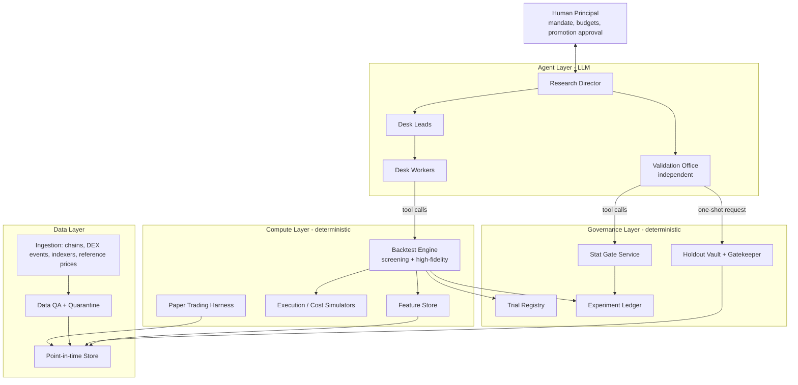
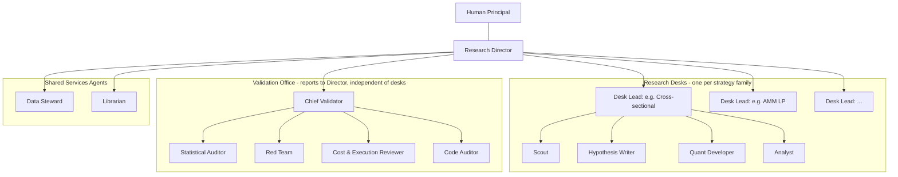
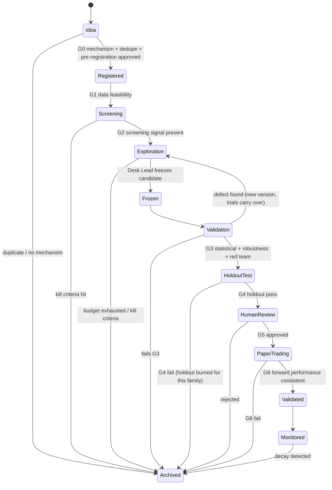

# QAM — Agentic Quantitative Research System: Design Document

| | |
|---|---|
| **Status** | Draft (living document) |
| **Version** | 0.1.0 |
| **Last updated** | 2026-10-05 |
| **Owner** | @brandongla |
| **Initial scope** | Cryptocurrencies on decentralized exchanges (DEXs) |
| **Future scope** | Equities, ETFs, options, futures, other asset classes |

> **How to use this document.** This is the single source of truth for QAM's specifications.
> Any change to scope, architecture, gates, thresholds, or agent roles must be reflected here in
> the same change set, with an entry in the [Decision Log](#17-decision-log) (for decisions) and the
> [Changelog](#19-changelog) (for every revision). Sections marked **[OPEN]** are not yet decided;
> sections marked **[DEFAULT]** contain starting values we expect to tune.

---

## Table of Contents

1. [Purpose & Goals](#1-purpose--goals)
2. [Non-Goals (v1)](#2-non-goals-v1)
3. [Guiding Principles](#3-guiding-principles)
4. [System Overview](#4-system-overview)
5. [Agent Hierarchy](#5-agent-hierarchy)
6. [Research Lifecycle (State Machine)](#6-research-lifecycle-state-machine)
7. [False-Positive Control Framework](#7-false-positive-control-framework)
8. [Data Platform](#8-data-platform)
9. [Simulation & Backtesting Engine](#9-simulation--backtesting-engine)
10. [DEX-Specific Realism Requirements](#10-dex-specific-realism-requirements)
11. [Initial Research Agenda (Crypto / DEX)](#11-initial-research-agenda-crypto--dex)
12. [Efficiency & Budgeting](#12-efficiency--budgeting)
13. [Provenance, Reproducibility & Memory](#13-provenance-reproducibility--memory)
14. [Extensibility to Other Asset Classes](#14-extensibility-to-other-asset-classes)
15. [Proposed Technology Stack](#15-proposed-technology-stack)
16. [Roadmap](#16-roadmap)
17. [Decision Log](#17-decision-log)
18. [Open Questions](#18-open-questions)
19. [Changelog](#19-changelog)
20. [Glossary](#20-glossary)

---

## 1. Purpose & Goals

QAM is a system in which **hierarchical teams of AI agents** generate, implement, test, and
critique quantitative trading hypotheses. Deterministic infrastructure does all the computation,
and statistical controls sit in the path of every result.

### Primary goals

| # | Goal | How we measure it |
|---|------|-------------------|
| G1 | **Minimize false positives.** Strategies that reach "Validated" should have real, persistent edge net of all costs. | Empirical pipeline false-discovery rate (FDR) from null-strategy injection (§7.6); decay from holdout to paper trading. |
| G2 | **Keep statistical power.** Don't reject real edges so aggressively that nothing gets through. | True-positive rate on synthetic planted-edge strategies (§7.6). |
| G3 | **Efficiency.** Get the most validated insight per dollar of compute and LLM spend. | Cost per hypothesis evaluated; cost per validated strategy; time from idea to decision. |
| G4 | **Reproducibility.** Any reported number can be regenerated exactly. | 100% of results linked to an immutable experiment record (§13). |
| G5 | **Extensibility.** New asset classes plug in through adapters without redesigning the core. | New asset-class adapter needs no changes to agent, lifecycle, or statistics code (§14). |

### Success criteria for v1
- An end-to-end pipeline that takes a DEX hypothesis from idea to a paper-trading decision with full provenance.
- A measured pipeline FDR at or below the target (§7.1) on injected null strategies.
- At least one strategy family evaluated through the full lifecycle. A well-documented rejection counts as success.

---

## 2. Non-Goals (v1)

- **Live trading with real capital.** v1 ends at paper/forward trading. Live deployment needs a separate design and explicit human approval.
- **Latency-competitive MEV searching** (sandwiching, sub-block atomic arbitrage). It needs a different infrastructure class (private orderflow, builder relationships, co-location). We **model** MEV as a cost and a risk, but we don't compete in it. See [Q-4](#18-open-questions).
- **Fully autonomous promotion.** A human approves every promotion past the holdout gate.
- **LLMs as calculators.** Agents never produce performance numbers by reasoning. All numbers come from deterministic tool runs (§3, P3).

---

## 3. Guiding Principles

| ID | Principle | Implication |
|----|-----------|-------------|
| P1 | **Every result is guilty until proven innocent.** | The default outcome of the lifecycle is rejection. Gates check for evidence of edge, not for absence of flaws. |
| P2 | **Count every trial.** | Every backtest, parameter variant, and feature tweak by any agent goes into the global Trial Registry. Multiple-testing corrections use the true count. |
| P3 | **Agents reason; tools compute.** | LLM agents design, code, critique, and interpret. A deterministic, versioned engine produces every metric. Any number an agent cites must reference an experiment ID. |
| P4 | **Separate generation from evaluation.** | Agents who propose or tune a strategy can't validate it. Validators can't modify it. |
| P5 | **Information barriers protect out-of-sample data.** | Holdout data sits in a vault behind a non-LLM gatekeeper. Access is one-shot, logged, and budgeted. |
| P6 | **Pre-register before you look.** | A hypothesis's economic rationale, signal definition, universe, and kill criteria are frozen before exploratory testing. Changes create a new version and count as new trials. |
| P7 | **Economics before statistics.** | A hypothesis needs a plausible mechanism (who loses money to us, and why do they keep doing it?) before testing. |
| P8 | **Realism over convenience.** | Simulate costs, slippage, gas, MEV, liquidity, and data availability at least as pessimistically as reality. |
| P9 | **Kill early, kill cheaply.** | Cheap screens come first and expensive validation last. Budgets are allocated adaptively. |
| P10 | **Asset-class agnostic core, asset-specific adapters.** | DEX specifics live behind interfaces (§14). |

---

## 4. System Overview

The system has four layers. Only the **Agent Layer** is LLM-driven. Everything below it is deterministic, versioned code.



### Component summary

| Layer | Component | Responsibility |
|-------|-----------|----------------|
| Agent | Research Director, Desk Leads, Workers, Validation Office | Hypothesis generation, implementation, critique, prioritization (§5) |
| Governance | **Trial Registry** | Append-only count of every trial, by hypothesis family and globally |
| Governance | **Experiment Ledger** | Immutable record of every run: code hash, data snapshot, params, seed, metrics |
| Governance | **Holdout Vault + Gatekeeper** | Isolates reserved data. Runs frozen strategies once and returns gated results |
| Governance | **Stat Gate Service** | Computes DSR, PBO, FDR-adjusted p-values, and robustness checks. Returns pass/fail per gate |
| Compute | **Backtest Engine** | Two tiers: fast vectorized screening and high-fidelity event-driven simulation (§9) |
| Compute | **Feature Store** | Cached, versioned, point-in-time features shared across desks |
| Compute | **Execution / Cost Simulators** | AMM math, gas, MEV haircut, latency, liquidity constraints (§10) |
| Compute | **Paper Trading Harness** | Forward testing on live data with simulated fills |
| Data | Ingestion, PIT store, QA | Canonical, bitemporal, quality-checked market and on-chain data (§8) |

---

## 5. Agent Hierarchy

### 5.1 Structure



### 5.2 Roles

| Tier | Role | Responsibilities | Can | Cannot |
|------|------|------------------|-----|--------|
| 0 | **Human Principal** | Sets the mandate, risk limits, and budgets. Approves promotions past holdout. Resolves escalations. | Everything | — |
| 1 | **Research Director** | Owns the research portfolio. Opens and closes desks, allocates compute/LLM budgets across hypotheses (§12), arbitrates disputes, writes periodic reports. | Allocate budget, kill hypotheses, request validation | Edit strategy code. See holdout results beyond pass/fail. |
| 2 | **Desk Lead** | Runs one strategy family. Prioritizes hypotheses, reviews pre-registrations, decides when a candidate is frozen. | Approve pre-registration, freeze a candidate, spend desk budget | Validate its own desk's candidates. Access the holdout. |
| 3 | **Scout** | Surveys literature, on-chain phenomena, and protocol changes. Proposes raw ideas with a mechanism. | Read the knowledge base and external sources | Run backtests |
| 3 | **Hypothesis Writer** | Turns ideas into formal pre-registrations (§6.2). | Draft pre-registrations | Run backtests |
| 3 | **Quant Developer** | Implements signals and strategies against the engine API and writes unit tests. | Write strategy code, run screening and development backtests | Change engine, data, or cost-model code |
| 3 | **Analyst** | Runs exploratory experiments within the pre-registered search space and interprets results. | Run development-period experiments | Run outside the pre-registered search space without a new registration |
| 2 | **Chief Validator** | Runs the Validation Office and issues the final verdict package to the Director. | Request holdout evaluation (once per frozen candidate) | Modify candidates |
| 3 | **Statistical Auditor** | Runs Stat Gate checks, checks the trial count, and looks for p-hacking patterns in the trial history. | Read the full trial history | Modify candidates |
| 3 | **Red Team** | Tries to break the candidate: leakage, lookahead, survivorship, regime dependence, fragile parameters, alternative explanations (e.g. it's just beta or a liquidity premium). | Design and run adversarial tests on development and validation data | Modify candidates |
| 3 | **Cost & Execution Reviewer** | Stress-tests costs, slippage, gas, MEV exposure, and capacity. | Run cost-stress scenarios | Modify candidates |
| 3 | **Code Auditor** | Reviews strategy code for bugs, lookahead, and misuse of the engine API. | Read code, run static and dynamic checks | Modify candidates. It files defects instead. |
| — | **Data Steward** | Monitors data QA, investigates anomalies, approves new data sources, maintains the data catalog. | Quarantine data, propose schema changes | Run strategy research |
| — | **Librarian** | Maintains the knowledge base of findings, rejected ideas, and reasons for rejection. Dedupes new ideas against prior work. | Write to the knowledge base | Run strategy research |

### 5.3 Separation of duties & information barriers

1. **Generator/evaluator split.** Desk agents never validate their own work. The Validation Office reports to the Director, not to desks.
2. **Holdout barrier.** Only the Gatekeeper service (non-LLM) reads holdout data. It accepts **only frozen candidates** (identified by code hash and config hash) and returns a **coarse verdict**: pass/fail per gate, plus a limited metric summary that goes to the Validation Office and the Human only. Desks receive pass/fail and the failed gate's name, but not the holdout metrics. That way they can't fit to the holdout through repeated feedback.
3. **Anchoring barrier.** The Red Team gets the pre-registration, the frozen code, and the trial count. It does **not** get the desk's narrative of why the strategy works until after its independent review.
4. **Write barriers.** Strategy agents can't modify engine, cost-model, or data code. Changes there go through the Data Steward or a human-reviewed change process. They also invalidate affected ledger entries (§13).
5. **Model diversity.** Where cost allows, validators run on a different model or prompt lineage than the generators, to reduce correlated blind spots.

### 5.4 Agent operating rules (enforced in prompts and by tooling)

- **R1 — Cite or don't claim.** Any quantitative claim must reference a ledger experiment ID. Unreferenced numbers are rejected by the report linter.
- **R2 — Stay in the registered search space.** Exploring beyond it requires a registration amendment, which increments the trial family.
- **R3 — Report failures.** Every run, including failed or abandoned ones, is logged automatically by the engine. Agents can't run untracked backtests.
- **R4 — State a mechanism.** Every hypothesis names the counterparty or friction that funds the edge.
- **R5 — Escalate, don't improvise.** If data looks wrong, an agent escalates to the Data Steward instead of patching around it inside strategy code.

### 5.5 Agent communication

- Agents communicate through **structured artifacts** (pre-registration, experiment request, validation report, verdict), not just free-form chat. Every artifact has a JSON schema and is stored in the ledger or knowledge base.
- Each agent's context is assembled from: its role prompt, the relevant artifacts, a knowledge-base retrieval (similar past hypotheses and their fates), and its tool permissions.

---

## 6. Research Lifecycle (State Machine)

### 6.1 States and gates



| Gate | Name | Owner | Pass criteria (summary) |
|------|------|-------|-------------------------|
| G0 | Registration | Desk Lead + Librarian | Plausible mechanism (R4). Not a duplicate of an archived idea, unless new evidence is stated. Complete pre-registration. |
| G1 | Feasibility | Data Steward | Required data exists, is point-in-time, passes QA, and covers enough history and regimes. |
| G2 | Screening | Desk Lead | Screening-tier backtest shows a signal in the expected direction, above a weak threshold, net of rough costs. |
| G3 | Validation | Validation Office | All Stat Gates (§7.3), robustness suite (§7.4), cost stress (§10), and code audit pass. Red Team has no unresolved critical findings. |
| G4 | Holdout | Gatekeeper (automated) | A one-shot run on the vault meets the pre-declared holdout criteria (§7.5). |
| G5 | Promotion review | Human | Human reviews the verdict package and approves paper trading. |
| G6 | Forward test | Stat Gate Service | Paper-trading performance is consistent with the validation estimate, within pre-declared tolerance, after the minimum duration. |

### 6.2 Pre-registration schema (frozen at G0)

```yaml
id: HYP-000123
version: 1
family: cross_sectional_momentum      # trial family for multiple-testing control
title: "Short-horizon momentum in mid-cap DEX tokens"
mechanism: >
  Who pays us and why it persists (e.g., slow information diffusion among retail
  traders on DEX; limited arbitrage capital in illiquid tokens).
universe:
  chains: [ethereum, base, arbitrum]
  venues: [uniswap_v3, aerodrome]
  filters: {min_pool_tvl_usd: 1_000_000, min_age_days: 90, exclude: [stablecoins, wrapped_majors]}
signal_definition: "Plain-language and pseudo-code definition of the signal"
search_space:                          # everything allowed to be tuned
  lookback_hours: [6, 12, 24, 48]
  holding_hours: [6, 12, 24]
  rebalance: [hourly, 4h]
expected_effect: {direction: positive, rough_magnitude: "SR 0.5-1.5 net"}
horizon_and_frequency: "intraday to multi-day"
cost_assumptions: "engine default DEX cost model v1 + 2x stress"
kill_criteria:
  - "Screening net SR < 0.3 across all search-space points"
  - "Effect disappears after excluding top 5 tokens by contribution"
data_requirements: [swaps, pool_state, token_metadata, gas]
max_trials_budget: 200
author_agents: [scout-07, hypwriter-02]
approved_by: desk-lead-xsec
```

The search space defines how many trials are allowed. Expanding it creates a new version and adds to the family's trial count.

---

## 7. False-Positive Control Framework

This section is the core of the design. Several mechanisms stack, because no single one is enough.

### 7.1 Targets [DEFAULT]

| Metric | Target |
|--------|--------|
| Pipeline FDR among strategies passing G4, measured via null injection | ≤ 5% |
| Pipeline power on planted edges of SR ≥ 1.0 (net), measured via synthetic positives | ≥ 60% |
| Holdout-to-paper Sharpe decay (median, across validated strategies) | ≤ 50% |

### 7.2 Data partitioning

Time is partitioned into four zones. The boundaries are configured per asset class and reviewed when the holdout is refreshed.

```
|<------------- Development ------------->|<-- Validation -->|<-- Vault (Holdout) -->|<-- Forward (Paper) -->
   exploration, tuning (walk-forward)        frozen-candidate    one-shot, gatekeeper    live data after freeze
                                             checks only          access only
```

- **Development:** Desks explore and tune here, using walk-forward / purged k-fold CV with embargo.
- **Validation:** The Validation Office uses this zone. Desks see only aggregated results.
- **Vault:** The most recent period, initially the last **9–12 months** [DEFAULT]. Only the Gatekeeper reads it.
- **Forward:** Data that didn't exist when the candidate was frozen. This is the cleanest test.
- **Cross-sectional holdout** [OPEN, Q-6]: Optionally reserve a random subset of tokens or pools, in addition to the time holdout.

**Holdout budget and refresh.** Each trial family has a holdout budget of [DEFAULT] **3 one-shot evaluations** per vault period. Once a family exhausts its budget, its holdout is "burned": further candidates from that family must wait for a vault refresh, when time rolls forward and the old vault merges into Development. Every Gatekeeper access is logged and goes into the trial count.

### 7.3 Statistical gates (G3) [DEFAULT thresholds]

| Gate | Method | Default threshold |
|------|--------|-------------------|
| SG-1 | **Deflated Sharpe Ratio** (Bailey & López de Prado), using the family's effective trial count from the Trial Registry and correcting for non-normal returns | DSR ≥ 0.95 |
| SG-2 | **Probability of Backtest Overfitting** via Combinatorially Symmetric Cross-Validation (CSCV) over the explored search space | PBO ≤ 0.20 |
| SG-3 | **Multiple-testing-adjusted significance** across all active families: Benjamini–Yekutieli FDR (valid under dependence), with a Holm–Bonferroni cross-check | q ≤ 0.05 |
| SG-4 | **Minimum t-stat hurdle** (Harvey–Liu–Zhu style) on net returns, using HAC / Newey–West standard errors | t ≥ 3.0 |
| SG-5 | **Minimum track record length** for the observed SR and higher moments | Observed sample ≥ MinTRL |
| SG-6 | **Effective sample size:** independent bets after accounting for overlap and autocorrelation | ≥ 100 independent bets, across ≥ 2 distinct market regimes |
| SG-7 | **Benchmark-adjusted alpha:** returns aren't explained by known factors (crypto market beta, size, liquidity, momentum, ETH/BTC beta) | Alpha t ≥ 2.5 after factor regression |
| SG-8 | **Concentration:** edge isn't driven by a handful of tokens, days, or trades | Passes SG-1 after removing the top 5% of P&L contributors |

**Effective trial count.** The Trial Registry records raw trials. The Stat Gate Service estimates *effective* independent trials by clustering trial return streams by correlation, as in the DSR literature. Raw count is the conservative upper bound. Effective count is used only if the clustering method is itself validated on synthetic data.

### 7.4 Robustness suite (G3)

| Test | Requirement |
|------|-------------|
| **Parameter stability** | Performance at neighboring points of the search space is ≥ 50% of peak. No isolated spikes. |
| **Subperiod stability** | Positive net performance in a majority of non-overlapping subperiods (e.g. quarters). No single subperiod contributes more than 40% of P&L. |
| **Regime analysis** | Performance reported across bull, bear, and chop markets, high/low volatility, and high/low gas. Regime dependence isn't disqualifying, but it must be pre-declared or justified. |
| **Universe perturbation** | Survives random 80% subsamples of the universe and alternative liquidity filters. |
| **Cost stress** | Net-positive at 2× modeled costs. Break-even cost multiple reported. |
| **Delay stress** | Net-positive with signal execution delayed by +1 block / +1 bar (or the asset-class equivalent). |
| **Placebo tests** | The signal shuffled in time or cross-section shows no edge. A sign-flipped strategy loses money. |
| **Leakage probes** | Lag every input by an extra period. If performance drops sharply, investigate for lookahead. |
| **Implementation equivalence** | Screening-tier and high-fidelity-tier results agree within tolerance. Any divergence must be explained. |

### 7.5 Holdout criteria (G4)

These criteria are declared when the candidate is frozen, before vault access. Default: on the vault period, net Sharpe ≥ 50% of the validation estimate, sign consistent, max drawdown within 1.5× of validation, and no gate-level data-quality alerts.

### 7.6 Calibrating the pipeline itself

The pipeline is a classifier, so we measure its error rates directly.

- **Null injection (false-positive rate).** We periodically inject **synthetic null strategies** through the full lifecycle: random signals, signals built on pure-noise features, and placebo versions of real hypotheses. They arrive as blinded tickets, so agents can't tell them apart from real work. Their pass rate at each gate estimates the per-gate and end-to-end false-positive rate.
- **Positive injection (power).** We inject **planted-edge** data or strategies with known Sharpe ratios to measure power at each gate.
- **Threshold tuning.** Gate thresholds in §7.3 are adjusted to meet the §7.1 targets. Every change is logged in the Decision Log.
- **Blinding integrity.** The share of injected tickets is a secret configuration value, known only to the Human and the Gatekeeper.

### 7.7 Common failure modes we explicitly guard against

| Failure mode | Guard |
|--------------|-------|
| Lookahead bias | Point-in-time data API (§8.3), leakage probes, code audit |
| Survivorship bias | Universe includes delisted/dead/rugged tokens and drained pools, at the PIT universe as of each date |
| Selection bias via silent retries | Engine-enforced trial logging (R3), Trial Registry |
| Overfitting via search-space creep | Pre-registration, versioning, trial carry-over |
| Holdout leakage through feedback | Coarse gatekeeper responses, holdout budget |
| Unrealistic fills | AMM-exact simulation, gas, MEV haircut, capacity limits (§10) |
| Fake volume / wash trading | Data QA filters (§8.4) |
| Agent hallucinated results | R1 cite-or-don't-claim, report linter |
| Correlated agent blind spots | Model/prompt diversity in the Validation Office |

---

## 8. Data Platform

### 8.1 Initial sources [OPEN — see Q-1, Q-2]

| Category | Candidate sources | Notes |
|----------|-------------------|-------|
| Raw chain data | Own or hosted archive nodes (EVM), RPC providers; Solana RPC / Geyser | Ground truth. Highest cost and effort. |
| Decoded DEX events | Indexers / data warehouses (e.g. Dune, Allium, Flipside, The Graph subgraphs), or self-decoding from raw logs | Faster start. Must verify against raw chain data. |
| Venues (initial) | Uniswap v2/v3/v4, Curve, Balancer, Aerodrome/Velodrome; optionally Raydium/Orca/Meteora (Solana); perp DEXs (Hyperliquid, dYdX, GMX) | Depends on the chain decision. |
| Reference prices | CEX prices (e.g. Binance, Coinbase) for context and labels only | Not tradeable in v1. Used for features and benchmarks. |
| Gas / fees | Block base fee, priority fees, L2 fee components | Required by the cost model. |
| Token metadata | Contract properties (fee-on-transfer, rebasing, blacklist/honeypot flags), launch time, supply schedule/unlocks | Required for universe filters. |
| MEV data | Public mempool archives, builder/relay data, sandwich detection datasets | Used to estimate MEV haircut. |

### 8.2 Canonical schema (asset-class agnostic core)

| Entity | Key fields |
|--------|-----------|
| `Instrument` | `instrument_id`, `asset_class`, `symbol`, `chain`, `contract_address`, `decimals`, `attributes{}` |
| `Venue` | `venue_id`, `type` (amm_v2, amm_clmm, orderbook, perp, exchange, …), `chain`, `fee_model` |
| `Market` | `market_id`, `venue_id`, `base`, `quote`, `pool_address`, `fee_tier`, `created_at`, `closed_at` |
| `MarketEvent` | `market_id`, `event_time`, `knowledge_time`, `block_number`, `tx_hash`, `log_index`, `type` (swap, mint, burn, trade, quote, funding…), `payload{}` |
| `MarketState` | `market_id`, `as_of`, state snapshot (reserves, sqrt price, tick liquidity map, order book, …) |
| `ChainContext` | `chain`, `block_number`, `timestamp`, `base_fee`, `priority_fee_pctiles`, `reorg_depth_seen` |
| `UniverseMembership` | `instrument_id`/`market_id`, `valid_from`, `valid_to`, `reason` |

### 8.3 Point-in-time (bitemporal) guarantees

- Every record carries `event_time` (when it happened) and `knowledge_time` (when our system could have known it, accounting for block finality, indexer lag, and reorgs).
- The research API only exposes data with `knowledge_time ≤ simulation clock`. There's no unrestricted query path for strategy code.
- **Finality policy** [DEFAULT]: Data is usable only after N confirmations per chain, with N configured per chain. Reorged events are retained and flagged.
- Snapshots are immutable and content-addressed. Every experiment references a snapshot hash.

### 8.4 Data QA & quarantine

- Schema and range checks, gap detection, and cross-source reconciliation (indexer vs raw logs, DEX vs CEX reference price).
- **Wash-trading / fake-volume filters**, e.g. self-trades, circular flows, and volume inconsistent with fees paid.
- **Token risk flags:** honeypot or blacklist logic, fee-on-transfer, rebasing, mint authority, extreme ownership concentration.
- Failing data is **quarantined**: excluded from research and listed on the Data Steward's queue. Strategies that consumed data that's later quarantined are flagged for re-run (§13).

---

## 9. Simulation & Backtesting Engine

### 9.1 Two tiers

| | Screening tier | High-fidelity tier |
|---|---|---|
| Purpose | Fast kill/keep at G2 and in Exploration | Validation (G3), Holdout (G4) |
| Style | Vectorized on bars | Event-driven, block-by-block (or tick-by-tick) |
| Costs | Parametric cost model (fee + slippage curve + gas average) | Exact AMM math against reconstructed pool state, actual gas by block, MEV haircut, latency |
| Speed target [DEFAULT] | < 60 s per trial on the standard universe | Minutes to hours |
| Trials logged | Yes | Yes |

**Implementation equivalence (§7.4)** ties the tiers together. A candidate can't advance if the two tiers disagree beyond tolerance without a documented explanation.

### 9.2 Engine contracts

- **Strategy interface:** `on_event(state, event) -> orders` (event-driven) and `compute_signals(panel) -> weights` (vectorized). The same strategy definition should compile to both where feasible.
- **Determinism:** Fixed seeds. Results must be bit-for-bit reproducible given (code hash, config hash, data snapshot hash, engine version).
- **Sandboxing:** Strategy code runs in a sandbox with no network access, no filesystem access outside the PIT API, and resource limits.
- **Automatic logging:** Every invocation writes to the Trial Registry and Experiment Ledger *before* returning results. There's no unlogged code path.

---

## 10. DEX-Specific Realism Requirements

| Concern | Requirement |
|---------|-------------|
| **AMM price impact** | Compute execution price exactly from pool state: constant product (v2), concentrated liquidity tick traversal (v3/v4), StableSwap invariant (Curve), weighted pools (Balancer). Multi-hop routes are simulated hop by hop. |
| **Liquidity & capacity** | Position size is limited to a configurable fraction of pool depth within X% price impact. Report a capacity curve (net return vs. notional). |
| **Fees** | Pool fee tier, protocol fees, aggregator fees if routing through one. |
| **Gas** | Actual base fee and priority fee per block for the transaction type. L2s include L1 data fees. Failed transactions also cost gas. |
| **MEV** | A sandwich/frontrun haircut on public-mempool orders, calibrated from historical MEV data. Scenario switch for private orderflow (e.g. MEV-protect RPCs) with different inclusion latency. |
| **Latency / inclusion** | Orders execute no earlier than the next block after the signal's `knowledge_time`. Inclusion probability is modeled under congestion. |
| **Token pathologies** | Fee-on-transfer and rebasing tokens handled or excluded. Honeypots excluded via QA flags. Rug-pulled tokens stay in the universe until their PIT exit. |
| **Bridging / inventory** | Cross-chain strategies model bridge fees, latency, and inventory constraints. No instant cross-chain netting. |
| **Funding (perp DEXs)** | Funding payments, mark/index price mechanics, liquidation rules, open-interest caps. |
| **LP strategies** | Fee accrual by in-range liquidity share, impermanent loss / loss-versus-rebalancing (LVR), rebalancing gas, JIT liquidity competition. |

---

## 11. Initial Research Agenda (Crypto / DEX)

Candidate desks. The Director opens 2–3 desks first [OPEN, Q-5].

| Desk | Hypothesis family examples | Key risk of false positive |
|------|---------------------------|----------------------------|
| **Cross-sectional** | Momentum / reversal across DEX tokens, liquidity-adjusted. Volume/TVL shocks. | Survivorship, illiquidity, small-cap concentration |
| **Time-series / trend** | Trend following on majors and mid-caps traded on DEX | Regime dependence (single bull run) |
| **On-chain flow** | Smart-money wallet flows, CEX deposit/withdrawal flows, bridge flows, whale accumulation | Lookahead via wallet labeling done after the fact; label leakage |
| **Event-driven** | Token unlocks, new pool launches, listings, governance votes, airdrops | Small event counts; clustering in time |
| **AMM liquidity provision** | Concentrated-liquidity range strategies, fee-tier selection, LVR-aware LP | Underestimated LVR/IL, JIT competition, gas |
| **Perp DEX carry / basis** | Funding-rate carry, perp vs spot basis on Hyperliquid/dYdX/GMX | Tail/liquidation risk, venue risk |
| **Cross-venue dislocations (non-latency)** | Persistent multi-block mispricings between pools/chains after accounting for bridge and inventory costs | MEV competition already captures most of it. Unrealistic fill assumptions. |

The Librarian seeds each desk's knowledge base with relevant literature and known prior results, including known negative results.

---

## 12. Efficiency & Budgeting

### 12.1 Budget hierarchy
- The Human sets the global budget (LLM tokens + compute + data costs) per period.
- The Director allocates to desks. Desk Leads allocate to hypotheses. Each hypothesis has a `max_trials_budget` and a cost budget from pre-registration.

### 12.2 Adaptive allocation
- The Director treats hypotheses as arms in a **multi-armed bandit**, prioritizing by expected information value. It uses screening results, mechanism quality scores, novelty (from the Librarian), and cost-to-test.
- **Important:** Adaptive allocation decides *where to spend effort*. It never relaxes statistical gates. Trials spent anywhere still count (P2).

### 12.3 Cost controls
- **Model tiering:** cheaper/faster models for scouting, summarization, deduping, and routine code. Strongest models for hypothesis design, red-teaming, and verdict synthesis. [OPEN, Q-8]
- **Prompt caching** of role prompts and shared context. **Feature-store caching** of computed features across desks.
- **Early stopping:** screening runs abort when kill criteria are hit. Exploration stops when the trial budget is reached.
- **Dedupe before work:** the Librarian checks new ideas against the knowledge base, including archived rejections, before registration.
- **Batching:** parameter sweeps run as one engine job rather than as many agent tool calls.

### 12.4 System KPIs (reported by the Director)
- Hypotheses registered, screened, validated, and promoted per period. Kill-reason distribution.
- Cost per hypothesis per stage. Cost per validated strategy.
- Pipeline FDR and power from injection (§7.6).
- Holdout and forward decay statistics.

---

## 13. Provenance, Reproducibility & Memory

### 13.1 Experiment Ledger record
```yaml
experiment_id: EXP-2026-000045
hypothesis_id: HYP-000123
hypothesis_version: 1
trial_family: cross_sectional_momentum
stage: exploration            # screening | exploration | validation | holdout | paper
engine_tier: screening
engine_version: 0.3.1
code_hash: sha256:...
config_hash: sha256:...
data_snapshot: sha256:...
params: {lookback_hours: 24, holding_hours: 12, rebalance: hourly}
seed: 42
requested_by: analyst-xsec-01
started_at: ...
metrics: {...}                # written by engine only
artifacts: [returns.parquet, trades.parquet]
status: completed             # completed | failed | aborted
```

### 13.2 Invalidation
If engine, cost-model, or data snapshot changes are found to be defective, dependent experiments are flagged automatically, and affected candidates go back to the appropriate state.

### 13.3 Knowledge base (organizational memory)
- Stores hypotheses, verdicts, kill reasons, red-team findings, and lessons learned, all searchable.
- **Negative results are first-class**, which keeps us from re-discovering the same false positive.
- Verdict summaries are generated from ledger data, not from agent memory.

---

## 14. Extensibility to Other Asset Classes

The core (agents, lifecycle, Trial Registry, Stat Gates, ledger) is asset-class agnostic. Each asset class supplies an **adapter bundle**:

| Interface | DEX crypto (v1) | Equities/ETFs (future) | Options (future) | Futures (future) |
|-----------|-----------------|------------------------|------------------|------------------|
| `DataAdapter` | Chain/indexer ingestion | Vendor feeds, corporate actions | Chains, IV surfaces | Contract rolls, continuous series |
| `UniverseProvider` | Pool/token filters, PIT listings | PIT index membership, delistings | Strike/expiry selection | Front/back contract rules |
| `ExecutionSimulator` | AMM math, gas, MEV | Spread, impact model, auctions | Bid/ask, greeks-aware fills | Tick size, limits, margin |
| `CostModel` | Fees, gas, MEV haircut | Commissions, borrow, taxes | Spreads, assignment | Commissions, roll costs |
| `Calendar` | 24/7, block-based | Exchange sessions, holidays | Expiry calendar | Session + roll calendar |
| `RiskFactorSet` | Crypto beta, size, liquidity, momentum | Fama-French style factors | Greeks, vol factors | Carry, trend, term structure |
| `PartitionPolicy` | Holdout duration, finality | Holdout duration | ... | ... |

Adding an asset class means implementing the adapter bundle and opening new desks. The validation framework doesn't change.

---

## 15. Proposed Technology Stack [OPEN — Q-7]

| Area | Proposal | Rationale |
|------|----------|-----------|
| Language | Python for research and agents. Rust (via PyO3) for hot paths later, e.g. CLMM tick simulation. | Ecosystem, speed where needed |
| Data | Parquet on object storage, DuckDB / Polars for query and compute | Columnar, fast, cheap, local-first |
| Metadata stores | Postgres for the Trial Registry, Ledger index, and Knowledge Base metadata. pgvector for semantic search. | Transactional integrity for registries |
| Agent runtime | Claude Agent SDK, with role-scoped tool permissions. Tools exposed as MCP servers (engine, data, registry, KB). | Permission scoping maps directly to §5 barriers |
| Orchestration | Workflow engine for lifecycle state (e.g. Temporal, Prefect, or a lightweight custom state machine) | Durable, resumable long-running research |
| Sandboxing | Containerized strategy execution with no network | Safety + leakage control |
| Experiment tracking | Custom ledger (above), optionally mirrored to MLflow for UI | Ledger is source of truth |
| Reporting | Auto-generated verdict packages (Markdown/HTML) from ledger data | R1 enforcement |

---

## 16. Roadmap

| Phase | Name | Scope | Exit criteria |
|-------|------|-------|---------------|
| 0 | **Design** | This document. Resolve critical open questions. | Q-1, Q-2, Q-5, Q-7 decided |
| 1 | **Data foundation** | Ingestion for the chosen chain(s) and venues. PIT store, QA, snapshots. | Reconciled swap and pool-state history for the initial universe, with QA report |
| 2 | **Engine & governance** | Screening tier, Trial Registry, Ledger, Stat Gate Service, Gatekeeper | Reproduces known textbook results. Null strategies are rejected at the expected rate. |
| 3 | **High-fidelity simulation** | AMM-exact execution, gas, MEV haircut, capacity | Simulated fills match a sample of real historical trades within tolerance |
| 4 | **Agent MVP** | Director + 1 desk + Validation Office, with operating rules and tooling enforcement | One hypothesis family processed end-to-end with full provenance |
| 5 | **Pipeline calibration** | Null and positive injection. Threshold tuning. | Measured FDR and power meet §7.1 targets |
| 6 | **Scale out** | Additional desks, bandit allocation, paper trading harness | Steady-state throughput and cost KPIs established |
| 7 | **Next asset class** | First non-crypto adapter bundle | Same lifecycle runs unchanged on the new asset class |

---

## 17. Decision Log

| ID | Date | Decision | Rationale | Status |
|----|------|----------|-----------|--------|
| D-001 | 2026-10-05 | Initial scope is crypto on DEXs. Core stays asset-class agnostic. | User direction. Adapters keep the door open (§14). | Accepted |
| D-002 | 2026-10-05 | LLM agents never compute performance metrics. Deterministic engine only. | Hallucination and reproducibility risk (P3) | Accepted |
| D-003 | 2026-10-05 | Holdout accessible only through a non-LLM gatekeeper with coarse feedback and per-family budgets | Prevents holdout overfitting via feedback loops (P5) | Accepted |
| D-004 | 2026-10-05 | Validation Office is organizationally independent of research desks | Separation of duties (P4) | Accepted |
| D-005 | 2026-10-05 | v1 ends at paper trading. No live capital. Latency MEV out of scope. | Focus on research quality first (§2) | Accepted |
| D-006 | 2026-10-05 | Pipeline error rates measured empirically via blinded null/positive injection | Makes "minimize false positives" measurable (§7.6) | Accepted |

---

## 18. Open Questions

| ID | Question | Options / notes | Needed by |
|----|----------|-----------------|-----------|
| Q-1 | Which chains first? | (a) Ethereum mainnet + Base + Arbitrum (EVM, shared tooling); (b) add Solana (high DEX volume, different tooling); (c) include perp DEX (Hyperliquid) | Phase 1 |
| Q-2 | Build vs buy for decoded data? | Self-decode from archive nodes (control, cost) vs warehouse/indexer (speed). Likely hybrid: buy to start, verify against raw. | Phase 1 |
| Q-3 | Target trading frequency / horizon? | Minutes–hours vs hours–days. Drives data granularity and engine design. | Phase 1 |
| Q-4 | Any latency-sensitive strategies in a later phase? | If yes, needs separate infra track (private orderflow, builder integration). | Phase 6+ |
| Q-5 | Which 2–3 desks first? | Suggest: Cross-sectional, Perp carry/basis, AMM LP. Different mechanisms, different failure modes. | Phase 4 |
| Q-6 | Add a cross-sectional (token-level) holdout in addition to the time holdout? | Increases protection, reduces training universe | Phase 2 |
| Q-7 | Confirm technology stack (§15) | — | Phase 1 |
| Q-8 | Model assignment per role and budget per period | Depends on cost targets | Phase 4 |
| Q-9 | Capital/notional assumptions for capacity analysis | e.g. $10k / $100k / $1M notional tiers | Phase 3 |
| Q-10 | Risk-management layer for paper trading (position limits, kill switches) | Required before any live consideration | Phase 6 |

---

## 19. Changelog

| Version | Date | Author | Changes |
|---------|------|--------|---------|
| 0.1.0 | 2026-10-05 | Claude (with @brandongla) | Initial draft: goals, principles, architecture, agent hierarchy, lifecycle, false-positive framework, DEX data/simulation requirements, research agenda, efficiency, extensibility, roadmap, decisions, open questions. |

---

## 20. Glossary

| Term | Definition |
|------|-----------|
| **CSCV** | Combinatorially Symmetric Cross-Validation. Used to estimate PBO. |
| **DSR** | Deflated Sharpe Ratio. The probability that the true Sharpe is > 0 after adjusting for the number of trials and non-normal returns. |
| **FDR** | False Discovery Rate. The expected fraction of false positives among declared discoveries. |
| **LVR** | Loss-Versus-Rebalancing. The cost an AMM LP bears from arbitrageurs trading against stale prices. |
| **MEV** | Maximal Extractable Value. Value extracted by ordering, inserting, or censoring transactions (e.g. sandwich attacks). |
| **MinTRL** | Minimum Track Record Length needed to reject SR ≤ 0 at a given confidence. |
| **PBO** | Probability of Backtest Overfitting. The probability that the in-sample-best configuration underperforms the median out of sample. |
| **PIT** | Point-in-time. Data as it was knowable at a given moment. |
| **Trial family** | A group of related trials (one hypothesis lineage) sharing a multiple-testing budget. |
| **Vault** | The reserved holdout dataset, accessible only through the Gatekeeper. |
